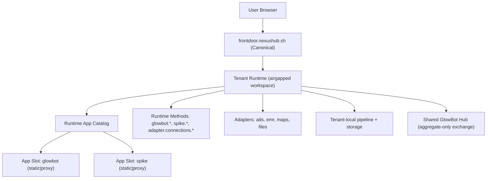

# GlowBot + Frontdoor Canonical App-Slot Architecture (Hard Cutover)

Date: 2026-02-27  
Status: approved canonical target state  
Owners: GlowBot, Frontdoor, nex runtime

---

## 1) Customer Experience First (North Star)

This architecture must produce one clear customer journey:

1. User lands on GlowBot entry domain (`glowbot-demo.vercel.app` for now).
2. User clicks `Continue with Google`.
3. User authenticates through Frontdoor OIDC.
4. Frontdoor resolves or provisions the correct product workspace.
5. User is launched into GlowBot UI for that workspace, not Nexus Control UI.
6. User configures adapters and starts receiving normalized pipeline data.

For returning users:

1. Login should reopen the correct product workspace automatically.
2. If a user has multiple app products on one tenant, app launch should be explicit and deterministic.

For platform evolution:

1. A single tenant runtime must be able to host multiple app surfaces (GlowBot, Spike, others).
2. Each tenant remains isolated (airgapped boundary per customer/workspace).

---

## 2) Non-Negotiable Constraints

1. Hard cutover only; no long-term backwards-compat behavior.
2. Airgapped tenant isolation is mandatory for sensitive customer data.
3. `frontdoor.nexushub.sh` is the canonical onboarding + launch domain.
4. `shell.nexushub.sh` should be redirect-only (compatibility entrypoint), not a separate product system.
5. App/adapters/method naming from existing specs remains stable.

---

## 3) Research Readout (Current Truth)

### 3.1 Frontdoor and routing

1. Frontdoor currently proxies both `/runtime/*` and `/app/*` to selected workspace runtimes.
2. Product-aware OIDC provisioning exists in Frontdoor server paths and autoprovision logic.
3. Existing-user + product flows are now handled in autoprovision store/model.

### 3.2 Runtime app serving model today

1. Runtime `/app/<app-id>/...` serving is static-root file serving (`runtime.apps.<app-id>.root`).
2. Current config model does not define a first-class server/proxy app hosting mode.

### 3.3 GlowBot app coupling today

1. GlowBot UI is a Next app with app-local API routes under `src/app/api/*`.
2. GlowBot method calls are bridged through app-local endpoints (for example pipeline and adapter bridge routes), not runtime-native `glowbot.*` server methods.
3. Runtime currently has `adapter.connections.*` methods, but no `glowbot.*` namespace in runtime method registry.

### 3.4 Verified production symptom

1. Runtime app catalog can include `glowbot`, but `/app/glowbot` currently serves Nexus Control bundle in production due to app-root mapping.
2. Identity smoke check exists and fails when forbidden control markers are present on GlowBot launch routes.
3. Provisioner now guards against mapping GlowBot root to control-ui root to prevent recurrence.

### 3.5 Entry-domain behavior gap

1. `shell.nexushub.sh` currently performs client-side redirect to `frontdoor.nexushub.sh`.
2. Frontdoor web OIDC start helper still needs explicit flavor/product forwarding guarantee in the OAuth start contract path.

---

## 4) Problem Statement

The platform currently has three architectural gaps:

1. Runtime app mounts are static-root file serving only.
2. GlowBot UI currently depends on Next server/API behavior and cannot be mounted as static artifacts without refactor.
3. GlowBot backend contract is app-local bridge logic instead of runtime-native method namespace.

Outcome: even when auth/provisioning succeeds, `/app/glowbot` can launch the wrong artifact or launch without a stable backend contract.

---

## 5) Option Analysis

## Option A: Static-only app mounts + runtime methods

Description:

1. Keep runtime app hosting static only.
2. Refactor GlowBot UI to static artifact.
3. Move GlowBot backend to runtime-native `glowbot.*` methods.

Pros:

1. Minimal runtime hosting complexity.
2. Strong fit with current runtime static serving path.

Cons:

1. Forces every app UI to be static-export compatible.
2. Blocks/complicates apps that legitimately need server-side rendering or server-owned API behavior.
3. Adds product constraints that do not match long-term multi-app flexibility.

## Option B: Proxy-only app mounts (app servers only)

Description:

1. All apps run as server processes.
2. Runtime/frontdoor always proxy app traffic to app servers.

Pros:

1. Supports existing Next app behavior immediately.
2. No static export requirement.

Cons:

1. Unnecessary operational cost for apps that are static-ready.
2. Removes efficient static hosting path already present in runtime.

## Option C: First-class app slots with hosting modes (`static` or `proxy`)

Description:

1. Runtime app config supports per-app hosting mode.
2. `static` apps use existing root-serving path.
3. `proxy` apps route through runtime to tenant-local app servers.
4. App backend contracts move to runtime method namespaces (`glowbot.*`, `spike.*`) regardless of hosting mode.

Pros:

1. Matches long-term multi-app per tenant vision.
2. Preserves tenant isolation.
3. Allows each app to choose correct hosting mode without architecture forks.
4. Enables gradual UI hosting evolution without changing business contract.

Cons:

1. Requires explicit runtime contract expansion (app mode + proxy settings).
2. Requires GlowBot contract migration away from app-local API bridges.

## Option D: Shared multi-tenant app server

Description:

1. Run one centralized app backend across many tenants.

Pros:

1. Lower process count.

Cons:

1. Violates airgapped tenant isolation requirements.
2. Increases tenancy-risk blast radius.

Decision: rejected.

---

## 6) Decision (Proposed Canonical Architecture)

Adopt Option C.

1. Frontdoor is the canonical entrypoint and workspace/app gateway.
2. Runtime supports app-slot hosting modes: `static` and `proxy`.
3. App backend contracts live in runtime method namespaces, not app-local API bridges.
4. Adapters remain connectors; UI is represented as apps, not adapters.
5. Multi-app on one tenant runtime is first-class.

## 6.1 Hard Supersession Decision: Transport Canon

This section resolves the conflict with older hosted docs that describe direct browser -> runtime as canonical.

1. For GlowBot/Spike product UX, canonical production transport is **browser -> frontdoor -> tenant runtime** for `/app/*` and `/runtime/*`.
2. Direct browser -> runtime token mode remains a supported capability, but it is not canonical for product onboarding/launch flows in this architecture.
3. `HOSTED_DIRECT_BROWSER_RUNTIME_CONTRACT.md` must be updated to reflect this cutover for product app flows, or explicitly scoped to non-product/operator-only flows.
4. No implementation may claim completion while transport canon remains contradictory across active specs.

---

## 7) Target Architecture

Key rule: app hosting mode can vary, but app business contract must remain runtime-native.

---

## 8) Required Contract Changes

## 8.1 Runtime app-slot contract

Add explicit hosting mode for each app slot:

1. `kind: "static" | "proxy"`
2. For `static`: `root` required.
3. For `proxy`: tenant-local upstream target required (`proxy.baseUrl` or equivalent).
4. App catalog must expose mode and validated launch entry.

## 8.2 Frontdoor launch semantics

1. Always resolve workspace first.
2. Launch path uses selected app slot from runtime app catalog.
3. Never silently fall back from requested app to control UI.
4. If requested app is missing or invalid, return explicit launch error state.

## 8.3 OIDC + product scoping

1. OIDC start/callback path must preserve and forward product/flavor context.
2. Existing users with product context resolve/provision into deterministic product launch targets per tenant allocation policy (below), not implicit per-product tenant fan-out.

## 8.4 GlowBot backend contract

1. Define and implement runtime-native `glowbot.*` methods for:
   - overview
   - funnel
   - modeling
   - agents
   - pipeline status/trigger
   - integration orchestration hooks
2. GlowBot UI RPC calls target runtime methods directly.
3. App-local `/api/pipeline/*` and `/api/runtime/adapter-connections` bridges are removed from primary path.

## 8.5 Tenant Allocation Policy (Explicit, Non-Ambiguous)

This policy removes ambiguity between product-scoped mapping and multi-app-on-one-tenant vision.

Definitions:

1. Workspace == tenant isolation boundary.
2. Product mapping selects launch target and enabled app slots; it does not imply mandatory new-tenant creation.

Allocation rules:

1. If user has an existing default workspace and no explicit isolation override, reuse that workspace/tenant and enable requested app slot there.
2. If user has multiple workspaces, use explicit active/default workspace selection; do not auto-create a new tenant unless no eligible workspace exists.
3. Create a new workspace/tenant only when one of the following is true:
   - user has no workspace,
   - explicit `create_new_workspace` intent is provided,
   - policy requires dedicated workspace for requested product/data class.
4. Product-to-workspace mapping is stored as a launch preference (`user_id + product_id -> workspace_id`) and can point multiple products to one workspace when policy allows.
5. Provisioner tenant naming must not encode product as a hard requirement for all new tenants once shared-tenant multi-app mode is enabled.

Implementation note:

1. Current `tenant-autoprovision.ts` behavior with product-prefixed tenant ids is transitional and must be replaced by this policy during cutover.
2. Option 3 is canonical for zero-server signed-in entry flows: `create_server_and_install` executes via entry orchestration and autoprovision while direct `POST /api/servers` remains policy-gated.

## 8.6 Proxy App-Slot Auth and Trust Contract

For `kind: "proxy"` app slots, auth/trust must be explicit end-to-end.

Frontdoor -> runtime:

1. Frontdoor validates user session and workspace membership before proxying.
2. Frontdoor forwards upstream bearer token minted by runtime token issuer with claims at minimum:
   - `iss`, `aud`, `iat`, `exp`, `jti`
   - `tenant_id`, `entity_id`, `session_id`, `client_id`
   - `roles`, `scopes`, `amr`
3. Runtime verifies signature, issuer, audience, TTL, and tenant pinning before handling request.

Runtime -> app server (proxy mode):

1. Runtime is the only caller of tenant-local app server upstream.
2. Runtime forwards trusted identity envelope headers:
   - `x-nexus-tenant-id`
   - `x-nexus-entity-id`
   - `x-nexus-session-id`
   - `x-nexus-app-id`
3. Runtime must strip any incoming client-supplied versions of those trusted headers.
4. App server treats trusted envelope as authoritative identity context and never trusts raw browser identity headers.

Token lifetime and refresh:

1. Access tokens are short-lived; refresh flow remains frontdoor-owned.
2. Proxy path must reject expired/invalid tokens with explicit auth errors (no fallback behavior).

Audit:

1. Frontdoor and runtime logs must include request-id + workspace-id + app-id for proxy requests.
2. Security tests must include header-spoof attempts and tenant mismatch rejection.

---

## 9) Execution Plan (Hard Cutover)

## Phase 0: Spec alignment and freeze

1. Mark this document as canonical architecture target.
2. Mark older shell-specific docs as superseded where conflicting.
3. Keep naming/contract terms stable.

Exit criteria:

1. Architecture approval from stakeholders.
2. No unresolved conflicts across active specs.

## Phase 1: Canonical domain consolidation

1. Keep `frontdoor.nexushub.sh` as single canonical entry.
2. Convert `shell.nexushub.sh` to HTTP redirect-only compatibility surface.
3. Ensure OAuth start in frontdoor web helpers forwards flavor/product fields.

Exit criteria:

1. Any legacy shell link lands on frontdoor with full query preserved.
2. Product-scoped OIDC provisioning path is deterministic in browser flow.
3. OIDC forwarding regression gate passes:
   - `/api/oidc-start?flavor=glowbot` forwards `product=glowbot` (or equivalent canonical field) to `/api/auth/oidc/start`.
   - `startGoogle()` includes selected flavor/product in query generation.

## Phase 2: Runtime app-slot mode implementation

1. Extend runtime config/types for `static|proxy` app modes.
2. Implement runtime app request handling for proxy mode.
3. Add validation guardrails for invalid/unsafe app roots and proxy targets.
4. Restrict control bootstrap injection to control app routes only.

Exit criteria:

1. Runtime app catalog reports mode and launchability.
2. Launch requests fail explicitly on bad app config, never silent fallback.
3. `/app/<non-control-app>` responses never receive control bootstrap injection.

## Phase 3: GlowBot backend contract migration

1. Implement runtime `glowbot.*` methods in tenant runtime.
2. Refactor GlowBot UI method transport to runtime RPC for production path.
3. Remove dependency on app-local pipeline/adapter bridge endpoints in primary flow.

Exit criteria:

1. Core GlowBot tabs function via runtime methods only.
2. No required production dependency on Next app-local API routes.

## Phase 4: GlowBot app-slot deployment

1. Choose GlowBot app hosting mode under new app-slot model:
   - `proxy` if GlowBot keeps Next server behavior, or
   - `static` if GlowBot artifact becomes static-compatible.
2. Configure tenant app slot accordingly.
3. Reprovision/update tenant configs using validated app root/proxy settings.

Exit criteria:

1. `/app/glowbot` serves GlowBot bundle/experience, never control bundle.
2. Launch identity smoke passes in production.

## Phase 5: Multi-app tenant validation

1. Register and launch both `glowbot` and `spike` app slots on one tenant.
2. Validate deterministic app selection, launch, and method namespace behavior.
3. Verify no cross-app or cross-tenant data leakage.

Exit criteria:

1. Single tenant supports multiple app slots safely.
2. Airgapped isolation expectations remain intact.

## Phase 6: Production E2E certification

1. Browser flow: landing -> Google OAuth -> provision/select workspace -> launch GlowBot app.
2. In-app flow: connect adapters -> trigger/backfill -> live monitoring -> normalized data visible.
3. Evidence bundle: logs, smoke outputs, screenshots, and endpoint checks.

Exit criteria:

1. Owner can run end-to-end manually and reproduce success.
2. All launch/data checks pass with no manual operator intervention.

---

## 10) Validation Matrix

## 10.1 Launch identity

1. Runtime catalog includes `glowbot` with valid mode/config.
2. `/app/glowbot?workspace_id=...` returns GlowBot artifact.
3. Forbidden control markers absent from launched JS assets.

## 10.2 Auth + provisioning

1. OIDC callback sets authenticated session.
2. Product-scoped workspace resolution/provisioning works for new and existing users.
3. Workspace selection survives refresh and relaunch.
4. Deterministic tenant allocation policy is enforced:
   - multi-product on one workspace reuses tenant by default,
   - new tenant creation occurs only under explicit allocation rules.
5. OIDC flavor/product forwarding test proves no regression for existing-user product login path.

## 10.3 Data and methods

1. `glowbot.*` method namespace available on runtime.
2. Integrations + pipeline tabs function without app-local bridge dependency.
3. Backfill and monitoring state surfaced in UI with explicit progress/error states.

## 10.4 Isolation and security

1. Tenant data remains tenant-local except aggregate-only hub exchange.
2. No cross-tenant session, method, or adapter access possible by routing mistakes.
3. App-slot config rejects unsafe root/proxy misconfiguration.
4. Proxy auth contract tests pass:
   - tenant claim mismatch rejected,
   - expired token rejected,
   - trusted-header spoof from browser ignored/rejected.
5. Control bootstrap injection is verified control-app-only.

---

## 11) Open Risks and Mitigations

1. Risk: ambiguous launch behavior during mixed old/new configs.
   Mitigation: hard cutover flags + explicit launch errors; no silent fallback.
2. Risk: migration gap if UI expects app-local API.
   Mitigation: contract-first runtime `glowbot.*` methods before route removal.
3. Risk: redirect ambiguity between shell and frontdoor.
   Mitigation: single canonical origin, redirect-only shell compatibility.
4. Risk: transport-canon conflict across specs causes implementation drift.
   Mitigation: explicit supersession decision in section 6.1 + aligned updates to hosted contract docs.

---

## 12) Superseded/Impacted Docs

These docs remain useful but must align to this canonical architecture where they conflict:

1. `specs/SHARED_ONBOARDING_GATEWAY.md`
2. `specs/GLOWBOT_DOMAIN_E2E.md`
3. `specs/PRODUCTION_E2E_CUTOVER.md`
4. `specs/FRONTEND_INTEGRATION.md`
5. `/Users/tyler/nexus/home/projects/nexus/nexus-specs/specs/nex/hosted/HOSTED_DIRECT_BROWSER_RUNTIME_CONTRACT.md`

Follow-up task: update impacted docs to remove conflicting assumptions about separate shell ownership and app-local API dependency.
