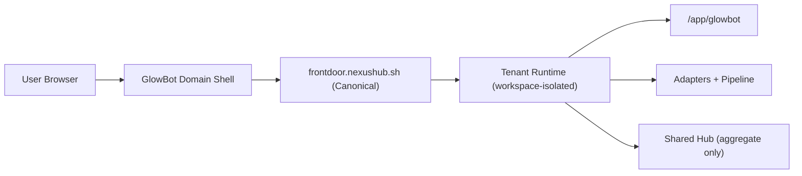

# GlowBot Production E2E Cutover (Goal In Stone)

Date: 2026-02-27  
Status: active execution plan (aligned)  
Owner: GlowBot implementation team  
Canonical architecture:
- `FRONTDOOR_CANONICAL_APP_SLOT_ARCHITECTURE_HARD_CUTOVER_2026-02-27.md`
- `CROSS_DOC_ALIGNMENT_FRONTDOOR_APP_SLOT_2026-02-27.md`

---

## 1) Goal In Stone

1. User lands on GlowBot domain shell.
2. User clicks Google sign-in and is routed through `frontdoor.nexushub.sh`.
3. Frontdoor resolves or provisions the correct workspace.
4. User launches into `/app/glowbot/` for that workspace.
5. User configures adapters and sees pipeline data update.
6. Shared GlowBot Hub exchanges aggregate-only benchmark data with tenant nodes.

Hard requirement:

1. Full flow must be reproducible in production without operator-only tooling.
2. No silent fallback to control UI when launching GlowBot app route.

---

## 2) Canonical Customer Flow

Key decisions:

1. Frontdoor is canonical onboarding + launch surface.
2. `shell.nexushub.sh` is redirect-only compatibility.
3. App slots are `static|proxy`; GlowBot launch must serve GlowBot assets, not control assets.
4. Workspace allocation follows explicit tenant reuse/new rules from canonical architecture spec.

---

## 3) Current Known Gaps

1. Production `/app/glowbot` identity can still fail when tenant app root is misconfigured.
2. OIDC flavor/product forwarding must be regression-tested in frontdoor web helpers.
3. Some specs still describe shared-shell canonical routing or per-product mandatory tenant fan-out.
4. Runtime `glowbot.*` method namespace migration is not fully complete yet.

---

## 4) Execution Phases

## Phase 0: Cross-doc alignment freeze

1. Align specs across `glowbot`, `spike`, `nexus-frontdoor`, and `nexus-specs`.
2. Mark contradictory direct-browser and per-product-tenant language as superseded for product app flows.

Exit:

1. No active doc claims `shell.nexushub.sh` is canonical.
2. No active doc requires one-workspace-per-product universally.

## Phase 1: Canonical domain and OIDC path

1. Product CTAs target `frontdoor.nexushub.sh`.
2. Legacy shell path redirects preserving query.
3. OIDC start forwards flavor/product context deterministically.

Exit:

1. Flavor/product OIDC forwarding test passes.
2. Existing-user login preserves product launch intent.

## Phase 2: Runtime launch correctness

1. Ensure runtime app catalog includes valid GlowBot app descriptor.
2. Enforce control-bootstrap injection only on control app routes.
3. Keep provisioner guard against GlowBot root == control-ui root.

Exit:

1. Launch identity smoke passes (`/app/glowbot` serves GlowBot markers; no control markers).

## Phase 3: App contract hardening

1. Complete runtime-native `glowbot.*` method handlers for core tabs.
2. Reduce/remove app-local bridge dependencies from primary production path.

Exit:

1. GlowBot tabs work through runtime-native methods.

## Phase 4: Production E2E certification

1. Browser flow: landing -> OAuth -> provision/select workspace -> launch GlowBot app.
2. Data flow: adapter connect -> backfill -> monitor/live sync -> normalized metrics visible.
3. Collect evidence bundle (request IDs, workspace IDs, app catalog, smoke output, screenshots).

Exit:

1. Owner can reproduce full E2E flow in production.

---

## 5) Validation Matrix

## 5.1 Auth and workspace

1. OIDC callback creates authenticated session.
2. Product/flavor forwarding deterministic for new and existing users.
3. Workspace selection/relaunch deterministic.

## 5.2 Launch identity

1. `/runtime/api/apps` contains `glowbot` for workspace.
2. `/app/glowbot` returns GlowBot bundle.
3. Control markers are absent from GlowBot launch assets.

## 5.3 Data and integrations

1. Adapter connection flow completes with clear status and error states.
2. Backfill and monitoring states are visible in UI.
3. Normalized pipeline outputs are visible in Overview/Funnel/Modeling/Agents.

## 5.4 Isolation and security

1. Tenant data remains tenant-local (except aggregate hub exchange).
2. Cross-tenant access attempts fail.
3. Proxy/trusted-header spoof tests fail closed.

---

## 6) Historical Note

Previous shared-shell-canonical flow language is superseded for product app flows.  
This file is now aligned to frontdoor-canonical onboarding and launch behavior.

