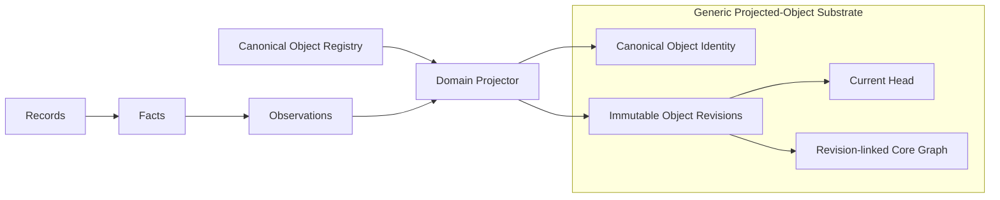

# Canonical Projected Objects

**Status:** CANONICAL
**Last Updated:** 2026-08-23
**Related:** [Nex Core Real-World Graph and Domain Facets](core-real-world-graph-and-domain-facets.md), [Continuous Evidence, Late-Arriving Evidence, and Review](continuous-evidence-late-arriving-evidence-and-review.md), [Canonical Projected Object Migration Board](../workplans/canonical-projected-object-migration-board/README.md)

---

## Purpose

Nex makes a legitimate domain object simple to define and uniform to use.

Once a canonical object type is registered, every object of that type has the
same complete behavior:

- a stable canonical identity;
- immutable revision history and a current head;
- direct Observation targeting;
- Core Graph addressability and typed relationships;
- exact resolution through one ordered, fail-closed interface;
- deterministic lineage to the Observations, Facts, and Records from which it
  was projected; and
- deterministic read receipts that require no durable read-custody workflow.

A domain author defines the object once. The projected-object substrate owns
the repeated identity, history, validation, resolution, and graph mechanics.

## Experience

Defining a new MoonSleep object requires one complete canonical declaration
and a projector that assembles its state from accepted Observations. The domain
author does not create a new object table, history table, head table, resolver,
Observation adapter, alias resolver, or Core Graph writer.

Conceptually:

```ts
defineObjectType({
  objectTypeId: "moonsleep.purchase_order",
  names: {
    singular: "Purchase Order",
    plural: "Purchase Orders",
  },
  acceptedPacketTerms: ["inventory_purchase_order"],
  searchTerms: ["PO", "supply order"],
  attributes: purchaseOrderAttributes,
  relationships: {
    supplier: "nex.entity",
    lots: "moonsleep.lot",
    productRevision: "moonsleep.product_revision",
    paymentApplications: "moonsleep.payment_application",
    shipments: "moonsleep.supply_shipment",
  },
})
```

If the declaration is incomplete or contradictory, registry publication fails.
If it is published, the type is canonical, resolvable, targetable, revisioned,
and graph-addressable. There is no partial activation lifecycle inside the
canonical registry.

## Canonical vocabulary

### Canonical Object Type

A Canonical Object Type is a registered class of independently meaningful
real-world or operational subjects, such as Purchase Order, Product Revision,
Manufacturing Run, Invoice, or Fulfillment Package.

Its registry identifier is globally stable, for example
`moonsleep.purchase_order`.

### Canonical Object

A Canonical Object is one stable instance of one Canonical Object Type. Its
identity persists across every change in projected attributes, relationships,
evidence, and lifecycle state.

The stable address is the tuple of `object_type_id` and
`canonical_object_id`.

### Object Revision

An Object Revision is one immutable, complete projected state of a Canonical
Object. It contains the object's attributes, relationships, semantic digest,
projector contract, predecessor revision, and exact supporting Observations.

### Current Head

The Current Head is the one Object Revision currently selected for a Canonical
Object. Advancing the head never rewrites or deletes an earlier revision.

### Projector

A Projector deterministically assembles one proposed Object Revision from
accepted Observations. A Projector supplies domain interpretation; it does not
implement object storage, identity history, target validation, resolution, or
Core Graph mechanics.

### Projected-Object Substrate

The Projected-Object Substrate is the deep Nex module that validates and
publishes Object Revisions, advances Current Heads, exposes exact resolution,
and publishes revision-linked Core Graph relationships for every registered
MoonSleep object type.

### Native Nex Object

A Native Nex Object is a universal Nex subject such as Entity, Place, Channel,
Loop, Commitment, or Facet Attachment whose identity is maintained by its
native Nex domain. Native objects satisfy the same ordered resolution interface
through native adapters. They are not copied into the MoonSleep
Projected-Object Substrate.

### Read View

A Read View is a query or workspace over canonical objects, Facets, evidence,
or other views. A route, filter, or projection handle does not make the view a
Canonical Object.

## System model



Records preserve immutable source data. Facts preserve source-grounded claims.
Observations preserve accepted interpretations. MoonSleep Canonical Objects are
the domain projections assembled from those Observations.

Every evidence-derived MoonSleep object attribute and relationship traces to
accepted Observations, which trace to sealed Facts and immutable Records. A
projected object never becomes an alternate evidence authority.

## Registry contract

The canonical registry contains only complete identity-bearing subject types.
It does not contain proposals, read views, receipts, compiler custody rows,
rebuildable projection rows, historical compatibility objects, or physical
storage names posing as semantic types.

Each entry declares:

- one stable `object_type_id`;
- preferred singular and plural names;
- the identity contract for canonical instance IDs;
- the immutable attribute schema;
- owner-scoped relationship slots and target contracts;
- accepted historical packet terms;
- non-authoritative human search terms;
- retired terms recognized only to return a correction; and
- the implementation binding.

Every `moonsleep.*` domain object entry binds to the same generic
projected-object implementation. Native Nex entries bind to native adapters at
the shared resolver seam.

The registry has no planned, compatibility-only, resolvable-only, or
targetable-later entries. Incomplete candidates live outside the canonical
registry until their complete declaration and implementation are ready.

Accepted packet terms are closed machine inputs and globally unambiguous.
Search terms may overlap and never drive automatic normalization. Physical
table, view, and field names are implementation metadata, not semantic aliases.

## Object eligibility

A noun becomes a Canonical Object only when the domain needs to:

1. refer to it independently with a stable identity;
2. preserve its changes as immutable revisions;
3. target it with Observations;
4. relate other canonical objects to it; and
5. resolve it independently over time.

If those needs do not exist, the noun belongs elsewhere. Statuses normally
become attributes or events. Revisions use the generic Object Revision model.
Links normally become typed relationships. Source identifiers remain Record or
Fact metadata. Receipts remain evidence custody. Collection rows normally
become membership or Read Views.

A noun found in a compiler packet or physical table is only a candidate. Its
presence does not grant canonical object status.

## Projected object model

The logical substrate contains:

```text
Canonical Object Identity
├── object_type_id
├── canonical_object_id
├── current_revision_id
└── identity_created_at

Object Revision
├── revision_id
├── object_type_id
├── canonical_object_id
├── previous_revision_id
├── attributes
├── relationships
├── supporting_observation_ids
├── projector_contract_id
├── registry_digest
├── semantic_sha256
├── evidence_basis_sha256
└── committed_at
```

The physical SQLite and PostgreSQL implementations may use several normalized
tables and indexes, but they expose this one logical model.

Canonical Object identity and the first Object Revision are committed
atomically. A registered target address may appear in an Observation before
materialization; resolution returns an explicit miss until the first revision
exists.

Canonical Objects are never hard-deleted. Retirement, cancellation,
supersession, or other terminal business meaning is represented in an immutable
revision. Supersession and merge relationships are explicit owner evidence and
are never inferred from similar attributes.

## Revision publication interface

Every Projector publishes through one interface:

```ts
publishObjectRevision({
  objectTypeId,
  canonicalObjectId,
  expectedPreviousRevisionId,
  attributes,
  relationships,
  supportingObservationIds,
  projectorContractId,
})
```

The substrate:

1. requires a registered Canonical Object Type;
2. validates the canonical identity contract;
3. validates attributes and relationships against the exact registry digest;
4. verifies every supporting Observation and its accepted state;
5. computes canonical semantic and evidence-basis digests;
6. treats an exact replay as an idempotent no-op;
7. uses compare-and-set against the expected Current Head;
8. appends one immutable Object Revision when semantic state changes;
9. publishes revision-linked Core Graph relationships; and
10. advances the Current Head atomically.

New evidence that does not change projected semantic state does not create a
new Object Revision. Its evidence and review history remains preserved in Nex
Observations. A changed attribute, relationship, or terminal state creates a
new revision.

Projector versions are replaceable implementations behind the publication
interface. The registry does not permanently bind an object type to one
Projector implementation. Every revision records the exact Projector contract
that produced it.

## Observation targeting

Every Canonical Object Type in this registry is directly targetable. An
Observation target is:

```text
object_type_id + canonical_object_id + attribute path or relationship slot
```

The generic target validator:

1. resolves the exact registry digest;
2. validates the object type and target address;
3. validates the attribute path or relationship slot;
4. validates the target type and cardinality for relationships;
5. commits the Observation without implicitly mutating object state; and
6. makes the affected target available for deterministic reprojection.

Observations do not directly rewrite object rows. Projectors consume accepted
Observation heads and publish complete Object Revisions.

Evidence pipeline objects such as Records, Facts, Fact Sets, Observations, and
receipts are addressable through their native evidence contracts but are not
Canonical Object Types in this registry merely because graph relationships may
reference them.

## Core Graph contract

Every relationship on a projected object revision uses a registered,
owner-scoped relationship slot. The revision owns the exact current target set
for each slot.

Current graph reads derive from Current Heads. Historical graph reads resolve
the relationships captured by the requested Object Revision. Advancing a head
never rewrites historical edges.

A graph edge carries semantic relationship only. It grants no provider write,
external action, financial posting, fulfillment, or communication authority.

## Resolution interface

All callers use one ordered batch interface:

```ts
resolveSubjects([
  {
    requestId,
    objectTypeId,
    observedSubjectId,
  },
])
```

Registry dispatch groups requests by implementation and restores original
request order. Each position returns either an explicit miss or the existing
Core Graph resolved-subject custody:

- `subject_class`;
- `observed_subject_id`;
- `canonical_subject_id`;
- `canonical_identity_sha256`;
- `adapter_contract_id`; and
- `read_receipt_sha256`.

Every `moonsleep.*` domain object uses one generic projected-object resolver.
Native Nex objects use native adapters behind the same interface.

Resolvers use exact point reads, never fuzzy search. Unknown types, ambiguous
identity, cardinality defects, stale registry digests, missing required state,
or malformed adapter results fail closed.

The read receipt is a deterministic digest of the registry digest, request,
canonical identity, selected revision or native row, semantic digest, and
complete owner read state. Ordinary resolution writes no receipt row and
requires no receipt operator or custody workflow.

## Native object adapters

Native adapters preserve the identity and revision semantics of their Nex
domain. They do not translate native objects into projected MoonSleep copies.

For native Channel, the supplied immutable Channel row ID is canonical, deleted
rows remain resolvable, the complete native read state including `deleted_at`
is receipt-bound, and route fields never imply a successor. A Communication
Stream or cross-domain view cannot replace native Channel resolution.

## Vocabulary and identity aliases

Vocabulary normalization and instance identity aliasing are separate.

Vocabulary metadata on a Canonical Object Type maps an accepted historical
packet term to one canonical type. It owns no identity, resolver, head, or
authority.

An instance identity alias maps one exact historical object address to one
exact canonical object address. It requires explicit custody or reviewed owner
evidence. Alias chains, cycles, fuzzy matching, and inferred successor identity
are forbidden.

New packets emit canonical object type IDs. Historical packets remain replayable
through a registry-digest-versioned decoder without creating active
compatibility objects.

## Read views

Read Views live in owner view catalogs outside the canonical object registry.
They name the Canonical Object Types and evidence contracts they compose but
own no independent graph head, Observation target, resolver, or mutation
authority.

If the business later requires a view noun to have independent stable identity,
revision history, Observation targeting, and relationships, the noun is
re-evaluated through the Object eligibility test and may become a Canonical
Object Type.

## Determinism and replay

Given the same registry digest, accepted Observation heads, Projector contract,
and canonical object identity, projection produces the same semantic payload
and relationship set.

Replaying an exact input is a no-op. Late-arriving or corrected evidence first
changes Nex Facts or Observations. A Projector appends a new Object Revision
only when the accepted domain understanding changes.

No replay rewrites an earlier Record, Fact, Observation, Object Revision, or
historical Core Graph relationship.

## Action boundary

Canonical objects represent accepted domain understanding. They do not confer
authority to send messages, purchase labels, move inventory, post accounting
entries, issue refunds, mutate providers, or perform any other external action.

Actions require their own domain authorization and source-owned readback.
Projection acceptance and action authority remain structurally separate.

## Required conformance

The registry compiler and substrate reject:

- incomplete canonical declarations;
- duplicate object type IDs or accepted packet terms;
- physical storage names accepted as semantic type IDs;
- read views, receipts, evidence rows, or compatibility objects in the
  canonical registry;
- MoonSleep object entries bound to per-object resolvers;
- unregistered attribute paths or relationship slots;
- relationship cardinality or target-contract violations;
- publication from missing or unaccepted Observations;
- stale-head revision publication;
- non-deterministic replay;
- alias cycles, chains, or ambiguous targets;
- resolver output with wrong order, cardinality, or custody shape; and
- any implicit external action authority.

SQLite and PostgreSQL implementations satisfy the same conformance suite.

## Rejected alternatives

### Per-object tables and resolvers

Rejected because each new domain noun would recreate identity, revision,
targeting, resolution, and graph machinery and would make current storage shape
part of the semantic model.

### Partial activation states

Rejected because a registry entry that is not resolvable and targetable creates
ambiguous partial truth. Incomplete work remains outside the canonical
registry.

### Separate Observation-adapter registry

Rejected for MoonSleep objects because targetability is uniform and generated
from the canonical object declaration. Native Nex adapters vary only at the
shared resolver seam.

### Compatibility objects and resolver fallbacks

Rejected because historical decoding requires vocabulary and exact instance
alias custody, not duplicate semantic heads or active fallback owners.

### Physical storage as canonical language

Rejected because tables and read models are implementations that can change
without changing the business object.

## Canonical decision

MoonSleep Canonical Objects are uniform projections of Nex Records, Facts, and
Observations. Declaring a legitimate object type once gives every instance
stable identity, immutable revisions, direct targeting, Core Graph
relationships, and exact resolution through one generic substrate. Native Nex
objects remain native and satisfy the same resolver interface. Migration and
current storage do not shape this target model.
