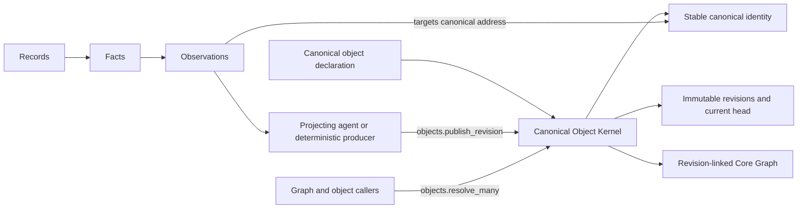

# Canonical Projected Objects

**Status:** CANONICAL
**Last Updated:** 2026-08-23
**Related:** [Nex Core Real-World Graph and Domain Facets](core-real-world-graph-and-domain-facets.md), [Continuous Evidence, Late-Arriving Evidence, and Review](continuous-evidence-late-arriving-evidence-and-review.md), [Canonical Projected Object Foundation Board](../workplans/canonical-projected-object-migration-board/README.md)

---

## Purpose

MoonSleep domain objects are projections of evidence already ingested into Nex:

```text
Records -> Facts -> Observations -> projecting agent -> canonical object revision
```

This specification defines the small Nex foundation that makes every legitimate
MoonSleep object uniformly identity-bearing, revisioned, targetable,
graph-addressable, and resolvable.

The foundation does not require a permanent projector implementation for each
object type. An authorized agent, deterministic program, or human-guided
workflow may project an object by calling the same generic publication
operation.

## Canonical decision

Nex provides one Canonical Object Kernel with two primary operations:

```text
objects.publish_revision
objects.resolve_many
```

Registering a complete new MoonSleep object type immediately gives every
instance the behavior owned by that kernel. A domain author does not create a
new object table, revision table, head table, resolver, Observation adapter,
graph writer, projector registration, or activation workflow.

An already-deployed MoonSleep projection that demonstrably has the same stable
identity, immutable revision history, target adapter, and owner read custody is
reused through the owner-resolution seam while it is incrementally converged.
Registration must never create a second canonical identity merely to move an
existing object into the generic tables.

Owner-backed reuse follows the same object contract without pretending the
generic kernel owns the revision rows. The registry declares the stable
identity and shared resolution binding; the owner reader returns the stable row
and exact selected revision state, and the kernel receipt-binds that complete
read. Revision-shaped rows and children wholly contained by one selected owner
revision do not become extra canonical object types.

There is no partially active registry entry. An incomplete candidate remains
outside the canonical registry.

## Canonical vocabulary

### Canonical Object Type

A Canonical Object Type is a registered class of independently meaningful
real-world or operational subjects, such as Purchase Order, Product Revision,
Manufacturing Run, Invoice, or Fulfillment Package.

Its globally stable registry identifier is an `object_type_id`, for example
`moonsleep.purchase_order`.

### Canonical Object

A Canonical Object is one stable instance of one Canonical Object Type. Its
identity persists while its attributes, relationships, evidence basis, and
business state change.

Its stable address is:

```text
object_type_id + canonical_object_id
```

The kernel derives `canonical_object_id` deterministically from the registered
identity contract ID and validated identity inputs. A projecting agent supplies
those inputs; it cannot choose an unrelated object ID. Replaying the same type,
contract, and identity inputs therefore reaches the same object.

### Object Revision

An Object Revision is one immutable, complete projected state of a Canonical
Object. It records the state, relationships, predecessor revision, projection
producer, and exact supporting Observations.

### Projecting agent

A projecting agent interprets Records, Facts, and Observations and proposes a
complete Object Revision. The agent supplies domain judgment. It does not own
object storage, revision history, target validation, resolution, or Core Graph
mechanics.

Deterministic code may act as a projecting producer through the same interface.
"Projecting agent" is the canonical term when an agent performs the work;
"Projector subsystem" is not part of this architecture.

### Canonical Object Kernel

The Canonical Object Kernel is the deep Nex module behind the two generic
operations. It owns canonical identities, immutable revisions, current heads,
provenance, relationship publication, exact resolution, and conformance for
all projected MoonSleep object types.

### Native Nex Object

A Native Nex Object is a universal Nex subject, such as Entity, Place, Channel,
Loop, Commitment, or Facet Attachment, whose identity is maintained by its
native Nex domain. Native objects resolve through small owner adapters at the
same resolution seam. They are not copied into MoonSleep projected-object
storage.

### Read View

A Read View is a query or workspace over canonical objects, Facets, evidence,
or other views. It does not acquire canonical identity merely because it is
useful to display or query.

## System model



Records preserve immutable source material. Facts preserve source-grounded
claims. Observations preserve accepted interpretations. Canonical Objects are
the current domain projections assembled from that evidence.

A Canonical Object is not an alternate evidence authority. Every projected
attribute and relationship traces through accepted Observations to sealed Facts
and immutable Records.

## Canonical object declaration

The registry contains only complete identity-bearing object types. It does not
contain proposals, read views, receipts, compiler custody, rebuildable rows,
historical compatibility objects, or physical storage names posing as business
language.

The executable declaration contract is
[`contracts/object-registry/v2`](../../contracts/object-registry/v2/README.md).
Registry v1 is retained only as research and migration input while concepts
converge independently.

A declaration contains only what the generic kernel needs to handle the type:

- one stable `object_type_id`;
- preferred singular and plural names;
- the canonical identity contract;
- the immutable attribute schema;
- relationship slots, cardinality, and target contracts;
- accepted historical input terms;
- non-authoritative human search terms;
- owning domain; and
- the resolution binding, which defaults to the generic projected-object
  implementation for `moonsleep.*` types.

The declaration does not name a permanent projector. Any authorized producer
may publish a conforming revision. Publication authority belongs to normal Nex
authorization policy, not to a second projector registry.

Native Nex declarations are imports, not copies. A native declaration names the
stable native subject class, identity-address contract, and owner resolution
binding required by the shared resolver. The native domain remains the sole
owner of its attributes, revisions, relationships, and storage. The Canonical
Object Kernel never republishes a native Entity, Place, Contact, Channel, Loop,
Commitment, Facet Definition, or Facet Attachment into projected-object tables.

The same no-copy rule applies during migration to an existing owner-backed
MoonSleep projection. Its v2 declaration imports its canonical address and
owner resolver. New revisions continue through the existing owner until a
separately proven storage migration can preserve every canonical ID, revision,
receipt, and replay result exactly. New MoonSleep object types use the generic
projected-object implementation immediately.

Conceptually:

```ts
defineObjectType({
  objectTypeId: "moonsleep.purchase_order",
  names: {
    singular: "Purchase Order",
    plural: "Purchase Orders",
  },
  acceptedInputTerms: ["inventory_purchase_order", "supply_order"],
  searchTerms: ["PO"],
  identityContractId: "moonsleep.purchase_order.identity.v1",
  attributes: purchaseOrderAttributes,
  relationships: {
    supplier: "nex.entity",
    productRevision: "moonsleep.product_revision",
    shipments: "moonsleep.supply_shipment",
  },
  ownerDomain: "moonsleep.supply",
});
```

If the declaration is published, the type is immediately targetable,
resolvable, revisioned, and graph-addressable. Registration is activation.

## Object eligibility and vocabulary consolidation

A candidate becomes a Canonical Object Type only when the domain needs to:

1. refer to it independently with stable identity;
2. preserve changes as immutable revisions;
3. target it with Observations;
4. relate other canonical objects to it; and
5. resolve it independently over time.

Each candidate receives exactly one decision:

```text
reuse | alias | create
```

- **Reuse** an existing Nex or MoonSleep object when identity and lifecycle are
  the same. Domain-specific data may live in a Facet.
- **Alias** another term when it names an existing concept.
- **Create** a new canonical type only when it passes the eligibility test.

Examples:

```text
moonsleep.commitment          -> reuse nex.commitment
moonsleep.communication_loop  -> reuse nex.loop
Supply Organization           -> reuse nex.entity + Supply facet
Facility                      -> reuse nex.place + Facility facet
inventory_purchase_order      -> alias moonsleep.purchase_order
supply_order                  -> alias moonsleep.purchase_order
PO                            -> search term for moonsleep.purchase_order
product_revision              -> alias moonsleep.product_revision
product version               -> alias moonsleep.product_revision
```

The following MoonSleep boundaries are canonical:

- a Manufacturing Run is an independently addressable production execution and
  is `moonsleep.manufacturing_run`;
- a Manufacturing Run Component is an independently addressable component
  workstream within a Manufacturing Run and is
  `moonsleep.manufacturing_run_component`;
- `inventory_purchase_order_component` and
  `purchase_order_component_line` are input terms for the single canonical
  `moonsleep.purchase_order_component_line` type;
- a Product Component Variant Rule remains embedded Product Revision or BOM
  state until evidence proves an independent identity and lifecycle; and
- accepted inspection work is a native `nex.commitment`; a separate service
  procurement type is created only if it later proves an independent lifecycle.

The first Supply convergence uses the generic kernel for Product Family, BOM
Version, BOM Line, Sample Article, Supplier Freight Quote, Supplier Freight
Quote Line, Purchase Order Component Line, Manufacturing Run, and Manufacturing
Run Component. The packet-era `public.supply_*` tables do not qualify as owner
imports: they expose mutable current rows and projection custody, but not one
immutable canonical revision stream and owner resolver for each object.

`sample_article_status` is not a second object type. Its historical rows are
accepted status evidence for the identified Sample Article and become Sample
Article revisions. Likewise, Product Component Variant Rule remains BOM or
Product Revision specification state. Neither packet noun receives an identity,
head, resolver, or registry entry.

Supply composition uses one canonical edge direction. A child points to its
parent (`part_of_bom_version`, `part_of_purchase_order`,
`part_of_manufacturing_run`, or `part_of_freight_quote`). Historical inverse
packet edges such as `has_quote_line` and `has_component_workstream` compile to
that same edge and are not published in parallel. A BOM Version points to the
Product Revision it specifies. A proposal does not publish `supersedes`.

`supersedes` always points from a newer accepted Product Revision to the older
accepted Product Revision it replaces. A proposed revision may exist with a
proposed state, but proposal evidence does not emit a supersession edge. The
historical term `proposed_successor` is interpreted as proposal state and is not
a second canonical relationship.

Statuses normally become attributes or events. Source identifiers remain
evidence metadata. Revision-like nouns use Object Revisions. Link-like nouns
normally become relationships. Packet and table nouns are candidates, not
automatic objects.

Vocabulary research is an input ledger, not a global activation gate. A
candidate may be decided and registered independently without waiting for every
other domain noun to be adjudicated.

## Generic logical model

The kernel exposes one logical model even if SQLite and PostgreSQL use multiple
physical tables and indexes:

```text
Canonical Object Identity
├── object_type_id
├── canonical_object_id
├── current_revision_id
└── identity_created_at

Object Revision
├── revision_id
├── object_type_id
├── canonical_object_id
├── previous_revision_id
├── attributes
├── relationships
├── supporting_observation_ids
├── projection_producer_id
├── projection_contract_id
├── registry_digest
├── semantic_sha256
├── evidence_basis_sha256
└── committed_at
```

Canonical identity and the first revision are committed atomically. Canonical
Objects are never hard-deleted. Retirement, cancellation, supersession, merge,
or other terminal meaning is represented by a new revision and explicit
relationships supported by owner evidence.

## Operation 1: `objects.publish_revision`

Every projecting agent and deterministic producer publishes through one
interface:

```ts
objects.publish_revision({
  objectTypeId,
  identity,
  expectedCurrentRevisionId,
  attributes,
  relationships,
  supportingObservationIds,
  projectionProducerId,
  projectionContractId,
});
```

The kernel:

1. requires a registered Canonical Object Type;
2. validates the identity inputs and derives the stable canonical address from
   the type's exact identity contract;
3. validates attributes and relationships against the exact registry digest;
4. verifies the supporting Observations and their accepted state;
5. computes canonical semantic and evidence-basis digests;
6. treats an exact replay as an idempotent no-op;
7. compare-and-sets the expected current revision;
8. appends an immutable revision when projected state or its evidence basis
   changes;
9. publishes revision-linked Core Graph relationships; and
10. advances the current head atomically.

An exact replay includes the same projected state, evidence basis, producer,
projection contract, and registry digest. Changed attributes, relationships,
business state, or supporting evidence append a revision. The stable canonical
identity does not change.

The kernel records who produced a revision, but the registry does not
permanently bind the type to that producer.

## Operation 2: `objects.resolve_many`

All callers resolve canonical subjects through one ordered batch interface:

```ts
objects.resolve_many([
  {
    requestId,
    objectTypeId,
    observedSubjectId,
    revisionId,
  },
]);
```

`revisionId` is optional and selects the current head when absent. Each input
position returns either an explicit miss or the existing Core Graph custody
fields:

- `subject_class`;
- `observed_subject_id`;
- `canonical_subject_id`;
- `canonical_identity_sha256`;
- `adapter_contract_id`; and
- `read_receipt_sha256`.

The kernel preserves request order, performs exact point reads, and fails
closed on unknown types, ambiguous identity, cardinality defects, stale
registry digests, malformed owner results, or missing required state.

The read receipt is a deterministic digest of the request, registry digest,
canonical identity, selected revision or native row, and complete owner read
state. Resolution creates no receipt row and requires no receipt operator.

Every new `moonsleep.*` projected object uses the generic implementation.
Already-deployed MoonSleep projections and native Nex objects may reuse owner
adapters behind this same interface when copying them would change canonical
identity or revision custody. Routing by resolution binding is an internal
implementation detail, not a separate declaration system or migration phase.

## Observation targeting and Core Graph

Every registered Canonical Object Type is directly targetable. An Observation
target is:

```text
object_type_id + canonical_object_id + attribute path or relationship slot
```

The registered identity contract can validate a canonical address before its
first revision exists. Until materialization, resolution returns an explicit
miss. Publishing the first revision creates identity and state atomically.

Observations do not directly mutate object state. They make accepted evidence
available to projecting agents, which publish complete revisions.

Relationships belong to exact Object Revisions. Current graph reads derive from
current heads; historical graph reads use the requested revision. Advancing a
head never rewrites historical edges.

Graph addressability grants no provider-write, fulfillment, accounting,
communication, or other action authority.

## Agent projection and historical interpretation

Agents are first-class projecting producers.

An agent may:

1. read Records, Facts, Observations, and existing canonical heads;
2. apply current domain and vocabulary rules;
3. assemble a complete proposed revision;
4. publish it through `objects.publish_revision`; and
5. verify the returned identity, revision, relationships, and provenance.

Historical interpretation is this same activity over older evidence. When an
old packet says `inventory_purchase_order`, an agent recognizes the accepted
input term and publishes `moonsleep.purchase_order` through the normal
operation.

Historical replay does not require a standing decoder subsystem, compatibility
object, fallback resolver, duplicate graph head, or one decoder per object.
Small deterministic decoders may remain only when they are active, correct,
and materially simpler than agent interpretation. Disabled or superseded
projectors and decoders are removed.

Historical packets and cursors are never rewritten.

## Native object resolution

Native Nex objects remain owned by their native domains. A small adapter is
needed only where native storage actually varies from the generic projected
store.

For `nex.channel`, the native owner adapter preserves the supplied immutable
Channel row ID as canonical, resolves deleted rows, binds the complete row
including `deleted_at` into the read digest, and never infers a successor from
route fields. Communication Stream data is not a Channel resolver.

Binding `nex.channel` is a contained part of the generic resolution operation,
not a prerequisite for declaring projected MoonSleep objects.

Already-deployed MoonSleep owner projections use the same registry-derived
owner route. Commerce Order preserves its Commerce stable row and revisions.
Finance preserves Cash/Card Source Account, Financial Transaction, and Invoice
stable identities plus their selected immutable owner revisions. Invoice lines
are complete state inside the selected Invoice revision; an Invoice Revision or
Invoice Line does not receive a parallel canonical head. Finance AP Party is a
subledger binding to canonical `nex.entity`, not a duplicate vendor identity.
General-ledger Financial Account remains distinct from provider Cash/Card Source
Account, and provider Payment remains distinct from a posted Financial
Transaction.

## Aliases and Read Views

Vocabulary aliases live on the canonical type and own no identity, resolver,
head, or authority. Exact instance identity aliases, when genuinely needed,
map one historical address to one canonical address under explicit owner
evidence. Alias chains, cycles, fuzzy matching, and inferred successors are
forbidden.

Read Views remain in owner view catalogs outside the identity registry. They
compose canonical objects and evidence but own no independent head, target,
resolver, or mutation authority.

## Incremental object convergence

After the kernel is proven, objects migrate independently. The complete loop
for one candidate is:

```text
classify reuse | alias | create
        -> declare owner import if reuse, or projected type if create
        -> owner resolves, or agent publishes canonical revision
        -> verify target, resolution, graph, and provenance
        -> move exact consumers
        -> delete superseded vocabulary and code
```

There is no required Supply-wide, Commerce-wide, Claims-wide, or Finance-wide
big-bang migration. A family may still be grouped when its identities are
inseparable, but family membership alone is not a reason to couple cutovers.

Legacy removal happens as each concept converges. The system does not preserve
disabled projectors, decoders, adapters, or compatibility declarations for a
future final migration.

## Action boundary

Canonical objects represent accepted domain understanding. They do not confer
authority to send messages, purchase labels, move inventory, post accounting
entries, issue refunds, mutate providers, or perform another external action.

Actions require separate domain authorization and source-owned readback.

## Required conformance

The registry and kernel reject:

- incomplete or duplicate canonical declarations;
- duplicate accepted input terms;
- physical storage names accepted as canonical type IDs;
- read views, receipts, custody rows, or compatibility objects in the registry;
- permanent per-object MoonSleep resolver or projector registrations;
- unregistered attributes or relationship slots;
- relationship cardinality or target-contract violations;
- publication from missing or unaccepted Observations;
- stale-head publication;
- non-deterministic replay;
- alias cycles, chains, fuzzy matches, or ambiguous targets;
- resolver output with wrong order, cardinality, or custody shape; and
- implicit external action authority.

SQLite and PostgreSQL implementations satisfy the same interface-level
conformance suite.

## Rejected alternatives

### Per-object storage, resolvers, and projector registrations

Rejected because each new noun would recreate generic mechanics and turn
current implementation shape into domain architecture.

### Permanent historical decoder subsystem

Rejected because historical vocabulary interpretation happens at projection
time and publishes through the same operation as current evidence.

### Domain-family migration framework

Rejected because the kernel is general and objects can converge independently.
Migration order follows business need, not today's table or packet families.

### Partial activation states

Rejected because a registry entry that is not fully targetable and resolvable
creates ambiguous partial truth.

### Separate Observation-target registry

Rejected because targetability is generated from the canonical object
declaration. Native storage varies only behind the shared resolution seam.

### Compatibility objects and resolver fallbacks

Rejected because aliases and projection-time interpretation preserve historical
meaning without duplicate semantic heads or active fallback owners.

## Final invariant

Declaring a legitimate MoonSleep object type makes the Canonical Object Kernel
available immediately. An authorized agent or deterministic producer may then
publish revisions derived from Nex Observations. Every published object has one
stable identity, immutable history, direct targeting, revision-linked graph
relationships, exact resolution, and evidence lineage through the same two
operations.
