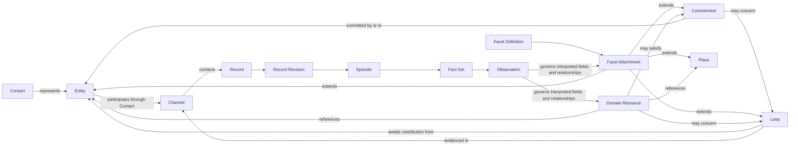

# Nex Core Real-World Graph and Domain Facets

**Status:** CANONICAL
**Last Updated:** 2026-08-14
**Related:** [Shared object registry](../../contracts/object-registry/v1/README.md), [Continuous evidence and review](continuous-evidence-late-arriving-evidence-and-review.md)

---

## Purpose

Nex provides a small universal graph that can absorb records from a business,
project, household, or personal life and preserve a reasonable understanding
of the real world without first knowing every consuming domain.

The core graph owns identities and semantics that are broadly reusable. A
domain extends those objects with versioned Facets, owns its genuinely
independent Resources, and assembles registered read projections and
workspaces for human use.

The model has three layers:

1. **Nex core** — universal identities, evidence, interpretations, Loops, and
   Commitments;
2. **domain extensions** — Facets on core objects plus domain-owned Resources
   with independent identity and lifecycle;
3. **workspaces** — purpose-built reads that compose core objects, Facets, and
   domain Resources without becoming new authorities.

## Core graph

The arrows are typed, effective-dated relationships. They are not permission
inheritance. Evidence, semantic acceptance, projection, and external action
remain separate authorities.

## Universal core objects

### Entity

An Entity is an identity-bearing actor: a person, organization, legal body,
software agent, team, or other actor that can participate, own, operate,
communicate, promise, or be responsible.

An Entity is not a catch-all noun for every identifiable thing. A warehouse is
a Place, not an Entity. A shipment is a domain Resource, not an Entity. An
organization operating a warehouse is an Entity related to that Place.

One real actor has one canonical Entity. Customer, supplier, carrier, creator,
lender, employee, and partner semantics do not create duplicate Entities.

### Place

A Place is a durable physical-place identity. It can represent a building,
site, room, dock, warehouse, factory, store, office, or other real-world
location whose identity persists even when its name, address, operator, or use
changes.

Addresses and coordinates describe a Place; they do not define it by
themselves. A Place can be operated by an Entity, contain another Place, host a
domain Resource, or be the location of an event.

### Contact

A Contact is a platform- and account-scoped address or account through which an
Entity is observed or contacted. Several Contacts can resolve to one Entity.
Matching strings are evidence for resolution, never silent authority to merge.

### Channel

A Channel is one native communication container and reply route. Provider
threads, direct-message conversations, support conversations, and equivalent
native containers remain individually visible. A cross-channel history is a
read projection, not a synthetic mega-Channel.

### Record and Record Revision

A Record is the stable source-object envelope. A Record Revision is immutable
custody of one exact provider or source revision. Records are evidence, not
business Resources and not accepted interpretations.

### Episode, Fact, Fact Set, and Observation

An Episode is an immutable bounded evidence set. Facts are immutable source-
grounded assertions. A Fact Set seals the exact Facts interpreted together. An
Observation is a versioned interpretation of that sealed input.

Every evidence-derived material field or relationship on a core object, Facet,
or domain Resource is governed by an accepted Observation. Operational custody
metadata and explicit human-entered configuration remain distinguishable from
interpreted business truth.

### Loop

A Loop is one material unresolved expectation for a contribution in an
interaction: a response, answer, clarification, decision, confirmation, or
other communicative next step.

A Loop records what remains open in the tapestry of communication. It is not a
provider thread, every message, a generic task, or proof that operational work
is owed. It can span several Channels while preserving every native Channel
and Record.

A Loop has:

- a stable identity and explicit supersession history;
- the initiating and participating Entities;
- the Entities currently expected to contribute;
- the expected contribution or decision;
- evidence Channels and Record Revisions;
- opened, current, and closed state with closure evidence;
- typed references to concerned core objects and domain Resources; and
- no implicit action or send authority.

Loop closure proves only that the expected contribution arrived or the
expectation was otherwise resolved. It does not prove a promise, shipment,
payment, refund, claim, or other operation completed.

### Commitment

A Commitment is an evidenced promise, accepted responsibility, or policy-
implied duty owed by one Entity to another Entity or defined beneficiary.

A Commitment has:

- a stable identity and explicit supersession history;
- committed-by and committed-to relationships;
- a precise statement of what is owed;
- the basis on which the commitment exists;
- time or condition boundaries;
- active, satisfied, breached, cancelled, or superseded state;
- exact completion evidence requirements; and
- no implicit mutation or provider authority.

A Loop and a Commitment may reference each other, but neither requires the
other. Asking a supplier a question creates a Loop. The supplier's explicit
promise may create a Commitment. Their answer can close the Loop while the
Commitment remains active. A customer question can create a Loop and a policy-
implied response Commitment when the applicable domain policy says MoonSleep
owes a response.

## Domain extension system: Facets

### Facet Definition

A Facet Definition is a versioned domain-owned extension contract. It declares:

- a stable facet name and version;
- the compatible core object or domain Resource classes;
- its typed attributes and relationships;
- validation and required-field rules;
- identity, cardinality, and effective-time semantics;
- evidence and Observation requirements;
- projection and mutation boundaries;
- its renderer/editor contract; and
- its migration rules between definition versions.

Examples include `MoonSleep Supplier`, `MoonSleep Customer`, `MoonSleep
Facility`, `MoonSleep Media Contact`, and `MoonSleep Financing Prospect`.

### Facet Attachment

A Facet Attachment applies one exact Facet Definition version to one exact
subject. It contains the domain-specific values and typed relationships for
that subject. An attachment can be effective-dated, superseded, reviewed, and
projected without changing or duplicating the subject's core identity.

The stable attachment identity is derived from the Facet Definition, subject,
domain scope, and attachment slot declared by the definition. A definition
must say whether a subject can have zero or one active attachment or a set of
independently identified attachments.

### Role, profile, and interface language

These words describe Facets; they do not create three additional storage
models:

- a **role** is the business meaning of a Facet, such as Supplier or Customer;
- a **profile** is the human-facing summary or editor for a Facet Attachment;
- an **interface contract** is the machine-facing portion of the Facet
  Definition.

The canonical nouns are Facet Definition and Facet Attachment. Product copy
may say role or profile when that is clearer to a human.

## Domain Resources

A domain creates an independent Resource only when the noun has a stable
identity, lifecycle, and authority that is not merely an extension of a core
object.

Orders, order lines, packages, fulfillment obligations, purchase orders,
invoices, payments, returns, refunds, carrier incidents, claims, lots, and
inventory positions are valid domain Resources. They reference core Entities,
Places, Loops, and Commitments and may carry their own Facets.

Customer, supplier, partner, lender, creator, media contact, and facility are
normally Facets or projections over Entity or Place. A domain must not create a
second person, organization, Place, Channel, Loop, or Commitment merely to
store domain fields.

## Workspaces and projected business nouns

A workspace is a registered read and interaction composition. It may have a
stable route, selection handle, filters, inclusion and closure criteria, and
governed actions. That does not make it a new canonical Resource.

Examples:

- **Organizations** composes Organization Entities, Contacts, Channels,
  Entity relationships, Facets, Places, domain Resources, and evidence.
- **Partners** is a saved Organizations view over partner-relevant Facets.
- **Customer Issues** selects customer Entities with open Loops, open
  Commitments, or related domain exceptions and gives the result a stable
  projection handle.
- **Customer communications** and **partner communications** are Entity-
  centered histories over native Channels, Records, Loops, and Commitments.
- **Facilities and Nodes** composes Places carrying Facility Facets with
  domain-owned fulfillment-node Resources.

Projection handles support URLs, review receipts, and change history. They do
not own the underlying truth and must resolve back to their exact constituent
objects.

## Identity and alias rules

1. Lookup proceeds from exact object to alias, then to a more general object,
   then to an owning-domain Facet or Resource, and only then to a new object.
2. Historical names and IDs remain resolvable aliases when they are needed for
   URLs, receipts, evidence, or audit.
3. An alias never creates a second semantic head or mutation authority.
4. Compatibility storage is not required merely because a historical noun
   existed. Preserve only what still has referenced identity, custody, or
   readback value.
5. Unresolved identity equivalence stays explicit and reviewable.

## Relationship rules

- Relationships are typed and declare owner, cardinality, subject slot, target
  class, effective time, and evidence requirements.
- Set-valued relationships include the target identity in their semantic head.
- Single-valued relationships use a stable slot and replace the conclusion
  through Observation supersession.
- A Facet does not take ownership of the core identity it extends.
- A workspace relationship is navigation until it resolves to a registered
  core, Facet, or domain relationship contract.
- No relationship grants action authority by implication.

## Non-goals

This model does not:

- turn every noun in product copy into a stored Resource;
- collapse Entity and Place;
- collapse Loop and Commitment;
- replace provider Channels with cross-provider threads;
- duplicate domain Resources inside Nex merely to make the graph uniform;
- require every domain to display the same workspace; or
- grant writes because evidence or an Observation was accepted.

## Canonical decision summary

Nex owns the small universal graph. Domains extend it with Facets and retain
their independently meaningful Resources. Workspaces compose both layers for
business use. New corpus extraction targets the core identity or the correct
Facet/Resource contract from the beginning, while historical business nouns
remain navigable through explicit aliases and projections.
