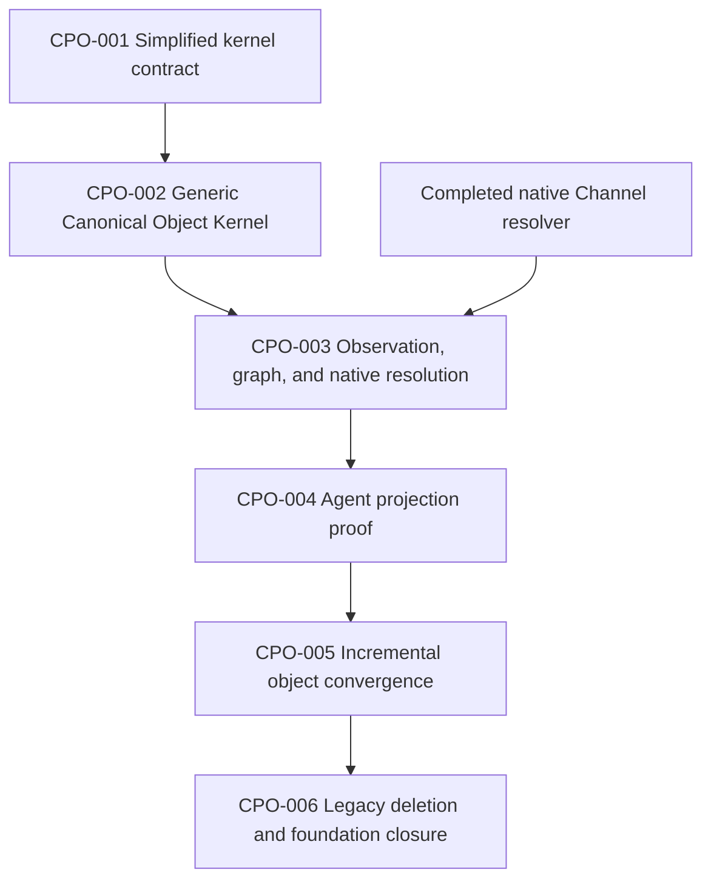

# Canonical Projected Object Foundation Board

**Status:** WORKPLAN
**Last Updated:** 2026-08-23
**Canonical spec:** [Canonical Projected Objects](../../specs/canonical-projected-objects.md)
**Related spec:** [Nex Core Real-World Graph and Domain Facets](../../specs/core-real-world-graph-and-domain-facets.md)
**Vocabulary ledger:** [Canonical Object Vocabulary Consolidation Ledger](consolidation-ledger.md)

---

## Outcome

Nex has one small Canonical Object Kernel. An authorized agent or deterministic
producer can project any registered `moonsleep.*` object through two generic
operations:

```text
objects.publish_revision
objects.resolve_many
```

The kernel supplies stable identity, immutable revisions, current heads,
Observation targeting, Core Graph relationships, exact resolution, and
evidence lineage. Native Nex objects remain native and resolve through owner
adapters at the same seam.

The foundation is proven with Purchase Order and Product Revision. After that,
objects converge one at a time according to business need. The board does not
create a domain-family migration framework, permanent projector registry, or
historical decoder subsystem.

## Deliberate simplification

The earlier 20-ticket plan incorrectly promoted implementation details and
domain migrations into architectural phases. This board replaces it with six
bounded tickets.

These are no longer separate phases:

- **Native dispatch** is an internal detail of `objects.resolve_many`.
- **Channel binding** is one contained native adapter integration in CPO-003.
- **Native reuse and Facet collapse** are `reuse | alias | create` vocabulary
  decisions made per candidate.
- **Canonical Supply declarations** are ordinary object declarations made when
  those objects are needed.
- **Supply projectors** are projecting agents or deterministic producers using
  the generic publication operation.
- **Historical decoding** is projection-time vocabulary interpretation, not a
  standing subsystem.

Disabled or superseded projectors and decoders are removal candidates. They are
not prerequisites for the new foundation.

## Current baselines

- Umbrella exact `origin/main`: `2540d28ca32e3642bb5e922a7b6934765a83733d`
- Nex exact `origin/main`: `7a7cea8966260c8ff998b1a418ad8c73ff9958de`
- MoonSleep exact `origin/main`: `95a2ec2f6d8b8f2d16e3475490764fb739b9bc85`
- Native Channel completed branch: `codex/native-channel-cleanup-20260823`
  - native owner resolver: `2c12f89d78`
  - crosswalk lifecycle/fallback deletion: `cc4f53a095`
  - migration/materialization deletion: `2ec08313fd`
  - generalized historical-ledger verification: `2acbd3e73d`
- Projecting and historical-interpretation agent:
  `codex://threads/019fec90-be1c-7cc3-8961-5c05caadd78d`

These hashes are planning baselines only. Each implementation ticket begins in
a clean worktree at then-current exact `origin/main` and records its immutable
source commit.

## Execution rules

1. Work one ticket at a time unless Tyler explicitly approves parallel work.
2. The canonical spec owns target semantics; tickets may not invent a second
   registry, projector system, decoder system, resolver system, or activation
   lifecycle.
3. Agents are first-class projecting producers. The registry never requires a
   permanent projector declaration for an object type.
4. Every registered `moonsleep.*` type uses the generic kernel immediately.
5. Every candidate receives one `reuse | alias | create` decision before
   registration. The exhaustive vocabulary census remains research input, not
   a global gate.
6. Migrate one object at a time unless two identities are demonstrably
   inseparable.
7. Delete replaced vocabulary and code as each concept converges. Do not carry
   disabled projectors or decoders toward a final big-bang cleanup.
8. Historical packets and cursors are never rewritten.
9. Source merge is not production authorization. Every production change has
   separate admission, readback, rollback or resume semantics, and receipts.
10. The active historical cursor remains paused until the exact CPO-004 proof
    and a separately approved resume transaction complete.

## Dependency DAG



The critical path is intentionally linear:

```text
CPO-001 -> CPO-002 -> CPO-003 -> CPO-004 -> CPO-005 -> CPO-006
```

The only external implementation input is the already-completed native Channel
resolver used by CPO-003. It does not block construction of the generic
projected-object kernel in CPO-002.

## Ticket index

| Ticket                                                               | State       | Outcome                                                                                   | Depends on              |
| -------------------------------------------------------------------- | ----------- | ----------------------------------------------------------------------------------------- | ----------------------- |
| [CPO-001](completed/CPO-001-simplified-kernel-contract.md)           | completed   | Canonical two-operation, agent-projection contract                                        | —                       |
| [CPO-002](completed/CPO-002-generic-canonical-object-kernel.md)      | completed   | Registry, identities, revisions, heads, provenance, and two generic operations            | CPO-001                 |
| [CPO-003](completed/CPO-003-observation-graph-native-resolution.md)  | completed   | Uniform targeting, revision-linked graph, and native Channel adapter binding              | CPO-002, Channel branch |
| [CPO-004](completed/CPO-004-agent-projection-proof.md)               | completed   | Agent projects Purchase Order and Product Revision end to end, including historical terms | CPO-003                 |
| [CPO-005](not-started/CPO-005-incremental-object-convergence.md)     | not started | Prove the repeatable one-object convergence loop and seed independent follow-on tickets   | CPO-004                 |
| [CPO-006](not-started/CPO-006-legacy-deletion-foundation-closure.md) | not started | Delete superseded foundation-era machinery and close the foundation proof                 | CPO-005                 |

## What happens after CPO-006

CPO-006 closes the foundation, not every future domain migration.

Each additional candidate becomes a small independent ticket using the template
established by CPO-005:

```text
classify -> declare if needed -> agent projects -> verify -> move consumers -> delete replacement
```

Examples may include Manufacturing Run, Supply Shipment, Joint Cargo Plan,
Invoice, Claim, or another business-needed object. Their order is determined by
the active evidence chronology and business need, not by a predeclared family
sequence.

The locked vocabulary census and ordered first convergence queue are recorded
in the [consolidation ledger](consolidation-ledger.md). The ledger does not
force all candidates to become objects and does not block an already-decided
object from using the kernel.

## Repository ownership

- **Umbrella repository** owns the canonical specification, registry contract,
  vocabulary decisions, and this board.
- **Nex core repository** owns the Canonical Object Kernel, generic operations,
  Observation targeting, Core Graph integration, owner-adapter seam, and
  conformance cleanroom.
- **MoonSleep repository** owns domain schemas, agent instructions or
  deterministic projection logic when useful, exact consumers, and governed
  production cutovers.
- **Native domains** own their identity readers. The Channel track supplies the
  completed `nex.channel` adapter implementation consumed by CPO-003.

## Board movement

- A ticket lives in exactly one state directory.
- Moving the file is the status change.
- `in-progress` requires an owner and exact current source commits.
- `completed` requires every acceptance criterion and named validation result.
- A source merge does not complete a production transaction.
- CPO-006 archives this foundation board only after the kernel, proof objects,
  replacement deletions, and continuation template are independently verified.

## Foundation acceptance

- One canonical v2 declaration registry contains complete identity-bearing
  object types only; registry v1 remains migration input, not a second active
  declaration system.
- One deep module exposes `objects.publish_revision` and
  `objects.resolve_many`.
- Agents and deterministic producers use the same publication operation.
- No permanent per-object MoonSleep resolver, target adapter, projector
  registration, or historical decoder subsystem is required.
- Purchase Order and Product Revision prove stable identity, idempotent replay,
  immutable revision advancement, targetability, graph addressability,
  resolution, and provenance.
- `nex.channel` resolves through its native owner without Communication Stream
  fallback or successor inference.
- Read Views, receipts, and action authority remain outside the object registry.
- Historical vocabulary is interpreted without rewriting packets or cursors.
- Replaced disabled projectors, decoders, compatibility declarations, and
  duplicate adapter paths are deleted.
- SQLite and PostgreSQL pass the same interface-level cleanroom suite.
