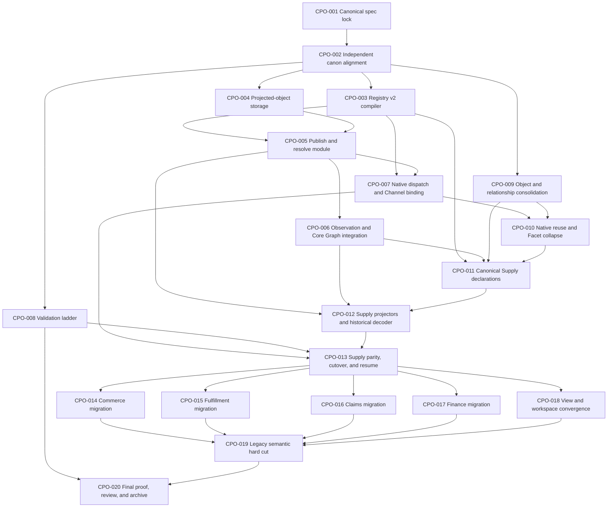

# Canonical Projected Object Migration Board

**Status:** WORKPLAN
**Last Updated:** 2026-08-23
**Canonical spec:** [Canonical Projected Objects](../../specs/canonical-projected-objects.md)
**Related spec:** [Nex Core Real-World Graph and Domain Facets](../../specs/core-real-world-graph-and-domain-facets.md)

---

## Outcome

Nex has one canonical object registry and one generic projected-object
substrate. Declaring a legitimate `moonsleep.*` object type atomically gives
its instances canonical identity, immutable revisions, direct Observation
targeting, Core Graph relationships, exact resolution, and evidence lineage.

Native Nex subjects resolve through native adapters at the same ordered batch
seam. Historical vocabulary remains replayable without compatibility objects,
fallback resolvers, duplicate graph heads, or rewritten historical cursors.

## Current baselines

- Umbrella exact `origin/main`: `2540d28ca32e3642bb5e922a7b6934765a83733d`
- Nex exact `origin/main`: `7a7cea8966260c8ff998b1a418ad8c73ff9958de`
- MoonSleep exact `origin/main`: `95a2ec2f6d8b8f2d16e3475490764fb739b9bc85`
- Native Channel completed branch: `codex/native-channel-cleanup-20260823`
  - native owner resolver: `2c12f89d78`
  - crosswalk lifecycle/fallback deletion: `cc4f53a095`
  - migration/materialization deletion: `2ec08313fd`
  - generalized historical-ledger verification: `2acbd3e73d`

These hashes are planning baselines, not permission to ignore newer exact main
at ticket execution. Every ticket starts from a clean worktree at then-current
`origin/main` and records its immutable source commit.

## Current gaps

The current system has:

- an object-registry v1 that mixes canonical objects, proposals, compatibility
  aliases, evidence custody, read models, physical storage, and open gaps;
- per-object Observation target declarations and duplicated adapter registries;
- MoonSleep object identity and revision mechanics spread across domain tables;
- hard-coded Nex and MoonSleep resolver paths;
- packet terms and physical table names leaking into semantic vocabulary;
- candidate packet nouns treated too readily as permanent object types; and
- relationship vocabulary that has not yet received the same many-to-one
  consolidation as object vocabulary.

## Execution rules

1. The canonical spec owns target state. Tickets may not redefine it.
2. The registry is binary: incomplete candidates remain outside it.
3. Every registered MoonSleep object uses the generic projected-object
   implementation and is immediately resolvable and targetable.
4. No ticket adds a per-object MoonSleep resolver or Observation adapter.
5. Current physical tables are migration sources or optional read models, not
   future semantic owners.
6. Historical packets and cursors are never rewritten. Compatibility is a
   versioned vocabulary decoder plus exact instance alias custody.
7. Native Entity, Place, Channel, Loop, Commitment, and Facet identities remain
   native and are never copied into MoonSleep projected-object storage.
8. Read receipts remain deterministic result digests with no read-receipt
   table, operator, or production workflow.
9. Every production cutover is separately admitted, reversible or resumable,
   and receipt-backed. Source merge is not production authorization.
10. The active Supply historical cursor stays paused until CPO-013 proves the
    canonical Supply family and explicitly releases it.

## Dependency DAG



The critical path is:

```text
CPO-001 → CPO-002 → CPO-003/CPO-004 → CPO-005 → CPO-006/CPO-007
        → CPO-010/CPO-011 → CPO-012 → CPO-013
        → remaining family migrations → CPO-019 → CPO-020
```

CPO-008 and CPO-009 deliberately run early and in parallel. No Supply object
declaration may bypass the consolidated candidate review, and no Supply cutover
may precede the cleanroom proof contract.

## Ticket index

| Ticket | State | Outcome | Depends on |
| --- | --- | --- | --- |
| [CPO-001](completed/CPO-001-canonical-spec-lock.md) | completed | Canonical target-state spec and board | — |
| [CPO-002](not-started/CPO-002-independent-canon-alignment.md) | not started | Independent spec/corpus reconciliation | CPO-001 |
| [CPO-003](not-started/CPO-003-registry-v2-compiler.md) | not started | Canonical-only registry and generated catalogs | CPO-002 |
| [CPO-004](not-started/CPO-004-projected-object-storage.md) | not started | Generic identity, revision, and head storage | CPO-002 |
| [CPO-005](not-started/CPO-005-publish-resolve-module.md) | not started | One publication and resolution interface | CPO-003, CPO-004 |
| [CPO-006](not-started/CPO-006-observation-core-graph-integration.md) | not started | Uniform targeting and revision-linked graph | CPO-005 |
| [CPO-007](not-started/CPO-007-native-dispatch-channel-binding.md) | not started | Native resolver dispatch and Channel binding | CPO-003, CPO-005, Channel branch |
| [CPO-008](not-started/CPO-008-validation-ladder-cleanroom.md) | not started | Durable conformance and cleanroom proof | CPO-002 |
| [CPO-009](not-started/CPO-009-object-relationship-consolidation.md) | not started | Approved object and relationship vocabulary | CPO-002 |
| [CPO-010](not-started/CPO-010-native-reuse-facet-collapse.md) | not started | Remove duplicate core identities | CPO-007, CPO-009 |
| [CPO-011](not-started/CPO-011-supply-declarations.md) | not started | Complete canonical Supply declarations | CPO-003, CPO-006, CPO-009, CPO-010 |
| [CPO-012](not-started/CPO-012-supply-projectors-decoder.md) | not started | Supply revisions and historical decoding | CPO-005, CPO-006, CPO-011 |
| [CPO-013](not-started/CPO-013-supply-cutover-resume.md) | not started | Supply parity, cutover, and cursor release | CPO-007, CPO-008, CPO-012 |
| [CPO-014](not-started/CPO-014-commerce-migration.md) | not started | Commerce projected-object convergence | CPO-013 |
| [CPO-015](not-started/CPO-015-fulfillment-migration.md) | not started | Fulfillment projected-object convergence | CPO-013 |
| [CPO-016](not-started/CPO-016-claims-migration.md) | not started | Claims projected-object convergence | CPO-013 |
| [CPO-017](not-started/CPO-017-finance-migration.md) | not started | Finance projected-object convergence | CPO-013 |
| [CPO-018](not-started/CPO-018-view-workspace-convergence.md) | not started | Read views leave the identity registry | CPO-013 |
| [CPO-019](not-started/CPO-019-legacy-semantic-hard-cut.md) | not started | Delete per-object adapters and duplicate authority | CPO-014 through CPO-018 |
| [CPO-020](not-started/CPO-020-final-proof-review-archive.md) | not started | Complete proof, independent review, and archive | CPO-008, CPO-019 |

## Repository ownership

- **Umbrella repository** owns the canonical spec, registry contract, generated
  cross-repository catalogs, vocabulary decisions, and this workplan.
- **Nex core repository** owns generic storage, publication, resolution,
  Observation targeting, Core Graph integration, native resolver dispatch, and
  cleanroom substrate proof.
- **MoonSleep repository** owns domain schemas, Projectors, object-family
  migrations, parity reads, and production cutovers.
- **Native Channel track** owns native Channel implementation. This board only
  binds the single `nex.channel` entry to its completed resolver interface.

## Board movement

- A ticket lives in exactly one state directory.
- Moving the file is the status change.
- `in-progress` requires exact source commits and an owner.
- `completed` requires every acceptance criterion and named validation result.
- A source merge does not complete a production-cutover ticket.
- When CPO-020 completes, archive this whole board under
  `docs/archive/workplans/` and retain the validation ladder as active proof
  corpus.

## Global acceptance

- One canonical registry contains complete identity-bearing subject types only.
- Every registered MoonSleep type uses the generic projected-object substrate.
- Every canonical MoonSleep object is revisioned, resolvable, directly
  targetable, and Core Graph addressable.
- Native objects remain native behind the same ordered batch interface.
- Every projected field and relationship traces through Observations, Facts,
  and Records.
- No duplicate semantic head, per-object adapter, active compatibility object,
  or fuzzy identity inference remains.
- Historical packets replay through a versioned decoder without cursor rewrite.
- Read views and receipts remain outside the canonical object registry.
- SQLite and PostgreSQL pass the same conformance suite.
- The active Supply history resumes only after its exact canonical family passes
  the named cutover gate.
