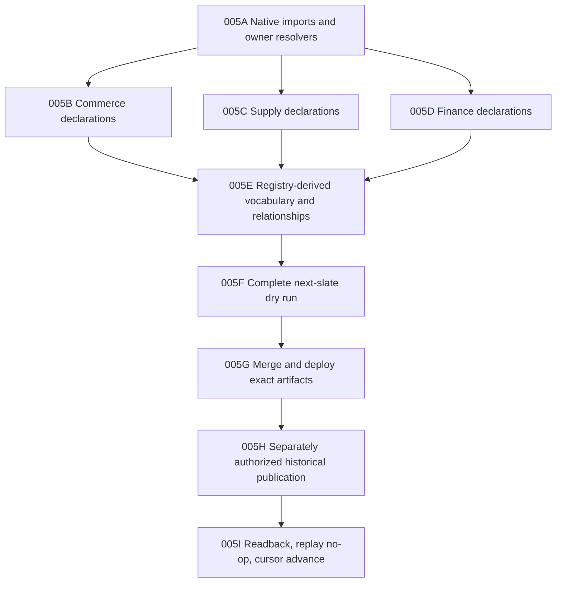

# CPO-005 — Historical-First Object Convergence

**State:** in progress
**Depends on:** CPO-004 and the historical-frontier object-language audit
**Owner:** canonical object-registry and vocabulary consolidation track
**Umbrella source:** `98174577d9cc20650c03e119d78c6471785c5902`
**Nex source:** `e479e58dde8bf4ac510cc10054a0ae6bfdfe928e`
**MoonSleep source:** `26d7e20aac1dab5f23eb605e4be8ad4d6bc02a29`

## Goal

Prove the generic object foundation against the first complete chronological
slate, while landing each declaration and owner binding as a small,
dependency-closed source slice.

The production boundary is the global interval:

```text
[2026-03-26T05:00:00Z, 2026-04-02T05:00:00Z)
```

No source ticket in this workplan authorizes historical publication or a cursor
advance.

## Approved semantic decisions

1. Create `moonsleep.manufacturing_run`.
2. Create `moonsleep.manufacturing_run_component` as an independently
   targetable supporting object.
3. Collapse `inventory_purchase_order_component` and
   `purchase_order_component_line` into
   `moonsleep.purchase_order_component_line`.
4. Keep Product Component Variant Rule embedded in Product Revision or BOM state
   until an independent lifecycle is proven.
5. Model accepted HQTS inspection work as `nex.commitment`; do not infer a
   Payment or create a service-procurement object now.

`supersedes` points from a newer accepted Product Revision to the older accepted
revision. Proposal evidence does not emit that edge.

## Execution DAG



Only one slice is active at a time unless Tyler explicitly changes that rule.
The active slice is **005A Native imports and owner resolvers**. Its source
implementation is complete; Linux/PostgreSQL cleanroom proof remains the gate
before 005B begins.

## Slice acceptance

Every source slice must prove:

- one canonical destination for every accepted input term in scope;
- exact owner resolution for existing identities and fail-closed misses;
- ordered batch and deterministic replay behavior;
- no projected copy of a native Nex identity;
- no second resolver or projector registry;
- no packet-local translation for migrated terms; and
- no historical packet, production semantic, or cursor mutation.

## Full-wave acceptance

- Every next-slate subject and relationship endpoint is classified as reuse,
  alias, create, Facet, view, evidence, or unresolved-stop.
- Every required stable identity resolves before semantic publication.
- Compiler normalization is generated or validated from registry v2.
- The dry run has zero withheld canonical links and zero duplicate identities.
- W0031 financial transactions, Purchase Order, and Commitment are not emitted
  as generic Payments.
- The proposed Product Revision remains proposed until acceptance evidence
  crosses the cursor.
- Existing SGD-0006 semantics and pre-April Customer Service continuity are
  reused rather than recreated.
- The final historical transaction has an explicit authorization, immutable
  source set, terminal receipt, replay-no-op proof, and cursor readback.

## 005A evidence

- Registry v2 compiles and validates 10 declarations with digest
  `a097f3124d873ba8f9a48d545474f80b32432fe22fe6cb2327d333712b6a106d`.
- The first native imports reuse one shared owner-resolver binding without
  copying native state into projected-object storage.
- Focused registry, resolver, kernel, and runtime-store validation passes 25 of
  25 tests; changed-file lint, formatting, and targeted type diagnostics pass.
- The shared Docker daemon was unavailable during the first cleanroom attempt,
  so Linux/PostgreSQL cleanroom proof is still required. This is a validation
  boundary, not authority to deploy, publish history, or begin 005B.
