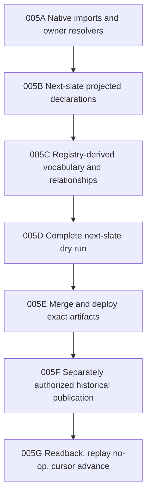

# CPO-005 — Historical-First Object Convergence

**State:** in progress
**Depends on:** CPO-004 and the historical-frontier object-language audit
**Owner:** canonical object-registry and vocabulary consolidation track
**Umbrella source:** `98174577d9cc20650c03e119d78c6471785c5902`
**Nex source:** `cedd7a350bad789fc5ed316af89a1911a377d96b`
**MoonSleep source:** `a9c61e9ad2d2c6eeab011a97109d3244531e40ec`

## Goal

Prove the generic object foundation against the first complete chronological
slate, while landing each declaration and owner binding as a small,
dependency-closed source slice.

The production boundary is the global interval:

```text
[2026-03-26T05:00:00Z, 2026-04-02T05:00:00Z)
```

No source ticket in this workplan authorizes historical publication or a cursor
advance.

## Approved semantic decisions

1. Create `moonsleep.manufacturing_run`.
2. Create `moonsleep.manufacturing_run_component` as an independently
   targetable supporting object.
3. Collapse `inventory_purchase_order_component` and
   `purchase_order_component_line` into
   `moonsleep.purchase_order_component_line`.
4. Keep Product Component Variant Rule embedded in Product Revision or BOM state
   until an independent lifecycle is proven.
5. Model accepted HQTS inspection work as `nex.commitment`; do not infer a
   Payment or create a service-procurement object now.
6. Create the nine independently addressable Supply types needed by the slate
   through the generic kernel; do not import the mutable packet-era
   `public.supply_*` rows as owner-backed canonical objects.
7. Collapse `sample_article_status` into Sample Article revision history.
8. Normalize inverse packet composition language to child-to-parent canonical
   relationships instead of publishing duplicate bidirectional edges.

`supersedes` points from a newer accepted Product Revision to the older accepted
revision. Proposal evidence does not emit that edge.

## Execution DAG



Only one slice is active at a time unless Tyler explicitly changes that rule.
The completed slice is **005A Native imports and owner resolvers**. The active
slice is **005B Next-slate projected declarations**, beginning with the bounded
Commerce identity cluster. Commerce, Supply, and Finance are declaration
batches inside 005B, not separate framework phases.

## Slice acceptance

Every source slice must prove:

- one canonical destination for every accepted input term in scope;
- exact owner resolution for existing identities and fail-closed misses;
- ordered batch and deterministic replay behavior;
- no projected copy of a native Nex identity;
- no second resolver or projector registry;
- no packet-local translation for migrated terms; and
- no historical packet, production semantic, or cursor mutation.

## Full-wave acceptance

- Every next-slate subject and relationship endpoint is classified as reuse,
  alias, create, Facet, view, evidence, or unresolved-stop.
- Every required stable identity resolves before semantic publication.
- Compiler normalization is generated or validated from registry v2.
- The dry run has zero withheld canonical links and zero duplicate identities.
- W0031 financial transactions, Purchase Order, and Commitment are not emitted
  as generic Payments.
- The proposed Product Revision remains proposed until acceptance evidence
  crosses the cursor.
- Existing SGD-0006 semantics and pre-April Customer Service continuity are
  reused rather than recreated.
- The final historical transaction has an explicit authorization, immutable
  source set, terminal receipt, replay-no-op proof, and cursor readback.

## 005A evidence

- Registry v2 compiles and validates 10 declarations with digest
  `a097f3124d873ba8f9a48d545474f80b32432fe22fe6cb2327d333712b6a106d`.
- The first native imports reuse one shared owner-resolver binding without
  copying native state into projected-object storage.
- Rebased Nex source commit `6eb878a1e3169ab619a2ea2e8f9b6f377ab9fcf8`
  preserves the native `nex.channel` contract and the communication-storage
  safety fingerprint
  `80ec9e528ec1c06518d3f24b7e9566930da0f89020d355c71e9dc4945ad905f0`.
- The reproducible Node 22.22.0/Linux/PostgreSQL 17 cleanroom passes all 35
  resolver, registry-routing, kernel, runtime-store, Core Graph, and agent
  projection tests. Changed-file lint, formatting, and targeted type
  diagnostics pass.
- Source validation does not authorize deployment, historical publication, or
  cursor movement. A later CPO release must remain a descendant of the stated
  Nex source and preserve its communication-storage safety contract.

## 005B active decision

- Reuse `moonsleep.commerce_order` through its deployed Commerce owner. The v2
  declaration preserves the existing `commerce_order_<sha256>` address and
  `commerce_order_revisions`; it must not publish a copied generic object.
- Normalize `commerce_order` and `shopify_order` to that object. Bare `Order`
  remains human search language because it is ambiguous with Purchase Order.
- Do not register or create `moonsleep.refund` for this slate until an exact
  provider refund identity is present. `refund_amount`, cancellation claims,
  and email statements are insufficient.
- Action/readback receipts remain evidence custody and are not registered as a
  substitute Commerce object.

### Commerce batch evidence

- Registry v2 compiles and validates 11 declarations with digest
  `adae37079bca014d7cffe1f430c55ad1fa4b5b495cf2ac7acb2e230a451321fa`.
- Rebased Nex commit `3253e24d38e2c20cb85a152e063bbc9ff530c492` adds the shared
  Core Graph owner adapter without a per-object routing table and keeps
  Commerce Order resolution ahead of generic-kernel fallback.
- The exact-current-main Node 22.22.0/Linux/PostgreSQL 17 cleanroom passes all
  45 tests. A real Commerce Order resolves with its deployed canonical ID,
  complete owner receipt, ordered batch position, and explicit miss behavior.
- The Commerce batch is source-complete. The active 005B batch is now Supply.

## 005B Supply decision

- Create `moonsleep.product_family`, `moonsleep.product_bom_version`,
  `moonsleep.product_bom_line`, `moonsleep.sample_article`,
  `moonsleep.supplier_freight_quote`,
  `moonsleep.supplier_freight_quote_line`,
  `moonsleep.purchase_order_component_line`,
  `moonsleep.manufacturing_run`, and
  `moonsleep.manufacturing_run_component` through
  `nex.canonical-object-kernel.v1`.
- Recompile `sample_article_status` rows as evidence-backed Sample Article
  revisions; do not register a Status object.
- Keep the legacy Supply evidence projector disabled. This source batch neither
  activates it nor creates a replacement projector registration.
- Normalize `supplier_freight_quotation` and
  `supplier_freight_quotation_line` as exact aliases of the canonical Freight
  Quote vocabulary.
- Preserve the already-approved Product Component Variant Rule and
  `proposed_successor` collapses: embedded specification state and proposal
  state respectively, with no extra object or relationship.

### Supply batch evidence

- Registry v2 compiles and validates 20 declarations with digest
  `b260059cc3b555f9ba62b0320fa7668d46b5f6667a9f302d80b231c3f6fb60a2`.
- Nex commit `0b4a3a5b71b76d332f25eed3b19956ad260df98b` adds the generated
  runtime registry plus a deterministic source-to-runtime generator. It adds no
  per-object resolver, table, projector, decoder, or activation path.
- The Supply conformance proof publishes Product Family, Product Revision,
  Purchase Order, BOM Version, BOM Line, Purchase Order Component Line, Sample
  Article, Supplier Freight Quote, Supplier Freight Quote Line, Manufacturing
  Run, and Manufacturing Run Component in dependency order. It then resolves
  every object and proves a historical Sample Article status becomes revision
  2 of the Sample Article.
- Exact-current-main source passes all 46 focused tests against a fresh,
  disposable PostgreSQL 17 cluster. Type-aware lint and formatting checks are
  green.
- The Linux/container cleanroom retry stopped before container creation because
  the local Docker daemon was unresponsive at `docker info`. The previous
  pre-Supply Linux/PostgreSQL cleanroom remains green, but this Supply batch is
  not yet claimed as Linux-cleanroom-proven.
- No production, historical packet, semantic publication, or cursor mutation
  occurred.
