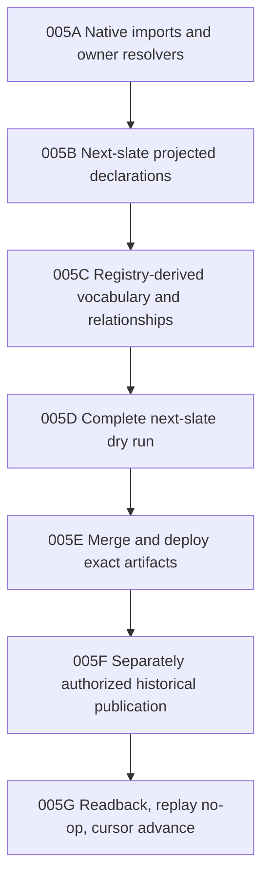

# CPO-005 — Historical-First Object Convergence

**State:** in progress
**Depends on:** CPO-004 and the historical-frontier object-language audit
**Owner:** canonical object-registry and vocabulary consolidation track
**Umbrella source:** `98174577d9cc20650c03e119d78c6471785c5902`
**Nex source:** `ff3c1cea9ddf3a1c1244f7535c174e1a0ed5ca40`
**MoonSleep source:** `baeda9025a71bc409cdc68fd6780f5c8a0f325ef`

## Goal

Prove the generic object foundation against the first complete chronological
slate, while landing each declaration and owner binding as a small,
dependency-closed source slice.

The production boundary is the global interval:

```text
[2026-03-26T05:00:00Z, 2026-04-02T05:00:00Z)
```

No source ticket in this workplan authorizes historical publication or a cursor
advance.

## Approved semantic decisions

1. Create `moonsleep.manufacturing_run`.
2. Create `moonsleep.manufacturing_run_component` as an independently
   targetable supporting object.
3. Collapse `inventory_purchase_order_component` and
   `purchase_order_component_line` into
   `moonsleep.purchase_order_component_line`.
4. Keep Product Component Variant Rule embedded in Product Revision or BOM state
   until an independent lifecycle is proven.
5. Model accepted HQTS inspection work as `nex.commitment`; do not infer a
   Payment or create a service-procurement object now.
6. Create the nine independently addressable Supply types needed by the slate
   through the generic kernel; do not import the mutable packet-era
   `public.supply_*` rows as owner-backed canonical objects.
7. Collapse `sample_article_status` into Sample Article revision history.
8. Normalize inverse packet composition language to child-to-parent canonical
   relationships instead of publishing duplicate bidirectional edges.

`supersedes` points from a newer accepted Product Revision to the older accepted
revision. Proposal evidence does not emit that edge.

## Execution DAG



Only one slice is active at a time unless Tyler explicitly changes that rule.
005A, 005B, 005C, and the corrected 005D zero-stop read-only dry run are
source-complete. No additional object type or relationship vocabulary is
required. The active slice is 005E source review, merge, exact artifact release,
and deployed resolver readback. These are convergence slices, not separate
domain frameworks.

## Slice acceptance

Every source slice must prove:

- one canonical destination for every accepted input term in scope;
- exact owner resolution for existing identities and fail-closed misses;
- ordered batch and deterministic replay behavior;
- no projected copy of a native Nex identity;
- no second resolver or projector registry;
- no packet-local translation for migrated terms; and
- no historical packet, production semantic, or cursor mutation.

## Full-wave acceptance

- Every next-slate subject and relationship endpoint is classified as reuse,
  alias, create, Facet, view, evidence, or unresolved-stop.
- Every required stable identity resolves before semantic publication.
- Compiler normalization is generated or validated from registry v2.
- The dry run has zero withheld canonical links and zero duplicate identities.
- W0031 financial transactions, Purchase Order, and Commitment are not emitted
  as generic Payments.
- The proposed Product Revision remains proposed until acceptance evidence
  crosses the cursor.
- Existing SGD-0006 semantics and pre-April Customer Service continuity are
  reused rather than recreated.
- The final historical transaction has an explicit authorization, immutable
  source set, terminal receipt, replay-no-op proof, and cursor readback.

## 005A evidence

- Registry v2 compiles and validates 10 declarations with digest
  `a097f3124d873ba8f9a48d545474f80b32432fe22fe6cb2327d333712b6a106d`.
- The first native imports reuse one shared owner-resolver binding without
  copying native state into projected-object storage.
- Rebased Nex source commit `e465b4de0fa84009f12c6b403c6780051679323c`
  preserves the native `nex.channel` contract and the communication-storage
  safety fingerprint
  `80ec9e528ec1c06518d3f24b7e9566930da0f89020d355c71e9dc4945ad905f0`.
- The reproducible Node 22.22.0/Linux/PostgreSQL 17 cleanroom passes all 35
  resolver, registry-routing, kernel, runtime-store, Core Graph, and agent
  projection tests. Changed-file lint, formatting, and targeted type
  diagnostics pass.
- Source validation does not authorize deployment, historical publication, or
  cursor movement. A later CPO release must remain a descendant of the stated
  Nex source and preserve its communication-storage safety contract.

## 005B active decision

- Reuse `moonsleep.commerce_order` through its deployed Commerce owner. The v2
  declaration preserves the existing `commerce_order_<sha256>` address and
  `commerce_order_revisions`; it must not publish a copied generic object.
- Normalize `commerce_order` and `shopify_order` to that object. Bare `Order`
  remains human search language because it is ambiguous with Purchase Order.
- Do not register or create `moonsleep.refund` for this slate until an exact
  provider refund identity is present. `refund_amount`, cancellation claims,
  and email statements are insufficient.
- Action/readback receipts remain evidence custody and are not registered as a
  substitute Commerce object.

### Commerce batch evidence

- Registry v2 compiles and validates 11 declarations with digest
  `adae37079bca014d7cffe1f430c55ad1fa4b5b495cf2ac7acb2e230a451321fa`.
- Rebased Nex commit `41f794107cf3a661f6d5fa8efded04edc8794906` adds the shared
  Core Graph owner adapter without a per-object routing table and keeps
  Commerce Order resolution ahead of generic-kernel fallback.
- The exact-current-main Node 22.22.0/Linux/PostgreSQL 17 cleanroom passes all
  45 tests. A real Commerce Order resolves with its deployed canonical ID,
  complete owner receipt, ordered batch position, and explicit miss behavior.
- The Commerce batch is source-complete. The active 005B batch is now Supply.

## 005B Supply decision

- Create `moonsleep.product_family`, `moonsleep.product_bom_version`,
  `moonsleep.product_bom_line`, `moonsleep.sample_article`,
  `moonsleep.supplier_freight_quote`,
  `moonsleep.supplier_freight_quote_line`,
  `moonsleep.purchase_order_component_line`,
  `moonsleep.manufacturing_run`, and
  `moonsleep.manufacturing_run_component` through
  `nex.canonical-object-kernel.v1`.
- Recompile `sample_article_status` rows as evidence-backed Sample Article
  revisions; do not register a Status object.
- Keep the legacy Supply evidence projector disabled. This source batch neither
  activates it nor creates a replacement projector registration.
- Normalize `supplier_freight_quotation` and
  `supplier_freight_quotation_line` as exact aliases of the canonical Freight
  Quote vocabulary.
- Preserve the already-approved Product Component Variant Rule and
  `proposed_successor` collapses: embedded specification state and proposal
  state respectively, with no extra object or relationship.

### Supply batch evidence

- Registry v2 compiles and validates 20 declarations with digest
  `b260059cc3b555f9ba62b0320fa7668d46b5f6667a9f302d80b231c3f6fb60a2`.
- Nex commit `6dc172d09d39717163df359575bbe11f4d50c251` adds the generated
  runtime registry plus a deterministic source-to-runtime generator. It adds no
  per-object resolver, table, projector, decoder, or activation path.
- The Supply conformance proof publishes Product Family, Product Revision,
  Purchase Order, BOM Version, BOM Line, Purchase Order Component Line, Sample
  Article, Supplier Freight Quote, Supplier Freight Quote Line, Manufacturing
  Run, and Manufacturing Run Component in dependency order. It then resolves
  every object and proves a historical Sample Article status becomes revision
  2 of the Sample Article.
- Exact-current-main source passes all 46 focused tests against a fresh,
  disposable PostgreSQL 17 cluster. Type-aware lint and formatting checks are
  green.
- The Linux/container cleanroom retry stopped before container creation because
  the local Docker daemon was unresponsive at `docker info`. The previous
  pre-Supply Linux/PostgreSQL cleanroom remains green, but this Supply batch is
  not yet claimed as Linux-cleanroom-proven.
- No production, historical packet, semantic publication, or cursor mutation
  occurred.

## 005B Finance decision

- Reuse `moonsleep.cash_card_account`,
  `moonsleep.financial_transaction`, and `moonsleep.invoice` through their
  deployed Finance owner. Preserve the existing `cca_<sha256>`, `cct_<sha256>`,
  and `api_<sha256>` identities and current immutable Finance revisions.
- Correct the historical-frontier shorthand: Mercury and Amex source-account
  identities are Cash/Card Source Accounts. `moonsleep.financial_account` is a
  distinct general-ledger account and is not required to resolve W0031 charges.
- Collapse `moonsleep.invoice_revision` into Invoice owner revision history and
  `moonsleep.invoice_line` into the complete selected Invoice revision state.
  Neither gets a second canonical head.
- Treat Finance AP Party as a reviewed subledger binding/facet on canonical
  `nex.entity`, not as a second vendor identity.
- Keep `moonsleep.payment` semantically distinct as a provider-native payment
  order. W0031 posted charges, Great American Packaging Purchase Order, and
  accepted HQTS Commitment must never normalize to Payment. A Payment
  Application remains unavailable without exact Payment and Invoice revision
  custody.

### Finance batch evidence

- Registry v2 compiles and validates 23 declarations with digest
  `e7185d7857313be4c5a66c8af2d1c1b5d524fedb09e3effa45c69f2127238ce4`.
- Rebased Nex commit
  `5f74e50c0f77a39b4124ae15981e91d22fd4f3d5` derives owner routing from the
  registry's shared `nex.core-graph.subject-resolver.v1` binding. It adds no
  second declaration registry and no Finance projector or activation gate.
- The Finance owner reader resolves complete Cash/Card Account and Financial
  Transaction stable/current revision rows. Invoice resolution includes the
  stable row, selected immutable revision, ordered lines, AP-party row, and
  current reviewed Entity binding. Exact supplied IDs remain canonical; missing
  rows fail closed; every complete read state is receipt-bound.
- The exact-current-main focused suite passes 48 tests against a fresh,
  disposable PostgreSQL 17 cluster. Type-aware lint, formatting, and the full
  Nex build are green. The build used the installed Node 26 runtime and emitted
  the repository's expected Node-engine warning; runtime-targeted compilation
  remained Node 22.12.
- Docker remained unresponsive, so this post-Supply source is not yet claimed
  as Linux/container-cleanroom-proven. No production, historical packet,
  semantic publication, or cursor mutation occurred.

## 005C vocabulary and relationship coverage

- Registry v2 is the only executable object-term normalizer. The conformance
  proof locks every next-slate accepted historical term to one canonical type
  and proves collapsed or evidence-dependent nouns remain unregistered.
- The complete MoonSleep owner-import set is mechanically derived from the
  shared owner binding and is exactly Commerce Order, Cash/Card Source Account,
  Financial Transaction, and Invoice. There is no parallel routing list.
- The consolidation ledger now gives an exact output for every next-slate
  Supply relationship phrase. Inverse `has_component_workstream`,
  `has_quote_line`, and Product Revision `specified_by` edges become their
  single child/BOM-owned canonical direction. Proposal relationships become
  proposal state or the existing Core Graph `concerns_resource` edge; they do
  not create duplicate semantic predicates.
- Nex commit `798697a7b2706d8133ee2e18d81c1aaa702f2f69` locks object-term,
  collapse, canonical relationship-slot, and registry-derived owner-import
  coverage. The full exact-current-main suite passes 52 tests against a fresh
  disposable PostgreSQL 17 cluster; type-aware lint and formatting are green.
- SGD-0007 relationships jointly dependent on the later F03 are outside the
  active cutoff. They are excluded from the candidate graph rather than counted
  as withheld links or inferred from F01/F02 alone.
- 005C is source-complete. Production and historical writes remain closed.

## 005D first dry-run evidence and exact stops

- The read-only artifact is
  `/Users/tyler/nexus/state/private/cpo005d-next-slate-readonly-dry-run-20260823.md`,
  SHA-256
  `14573d6e29f43e390d4290b9b5534bc527811dfefb7114165ceccdd4ed8bfd00`.
  It binds the exact C006, C007, W0031, SGD-0006, SGD-0007, and registry-v2
  inputs and leaves the global cursor at `2026-03-26T05:00:00Z`.
- All accepted nouns and relationship classes in the interval fit the existing
  23 declarations. No 24th declaration, resolver family, or packet-local object
  type is required.
- All 27/27 Shopify Order references resolve through the Commerce owner after
  deterministic normalization from a bare numeric provider ID to
  `gid://shopify/Order/<numeric>`. The selected Commerce revisions point to
  active native Entity and Contact rows.
- The frozen packet identity candidates themselves are not canonical: 0/34
  packet Entity IDs, 0/32 packet Contact IDs, and 0/15 packet Facet Attachment
  IDs resolve. The compiler must substitute the owner/native IDs and must never
  publish these packet-era candidate IDs.
- All 89/89 email-stream member revision rows bind to immutable Records. The 27
  derived `email_stream_*` collections expand to 38 native Channel logical
  keys. Because one collection can span multiple Channels, the compiler emits
  a set of `evidenced_in_channel` edges after native point resolution, never a
  synthetic Channel or crosswalk.
- W0031 resolves four exact Mercury Financial Transactions in the Mercury
  Credit Cash/Card Source Account. The Amex Account exists, but the VistaPrint
  Financial Transaction and AP Invoice do not; absence remains explicit rather
  than inventing owner identities. GAP remains a Purchase Order and HQTS a
  Commitment. No Payment or Payment Application is emitted.
- SGD-0006 is reused. Only SGD-0007 F01, F02, and F04 are inside the cutoff. F03
  and every F03-dependent Resource or relationship are non-candidates, not
  withheld links. F01/F02/F04 require cutoff-local Observations rather than a
  frozen cross-cutoff projection.

## 005D corrected zero-stop rerun

- Human report:
  `/Users/tyler/nexus/state/private/cpo005d-next-slate-zero-stop-rerun-20260823.md`,
  SHA-256
  `cb9c206b3a5f9587891df99748619fc112c82ca40f82cff9932ae033cec88894`.
- Machine proof:
  `/Users/tyler/nexus/state/private/cpo005d-next-slate-zero-stop-rerun-20260823.json`,
  SHA-256
  `a8fd7bf5b34ead1b498981454c47b7759e2b7fd42fc5129b0f54d237f843e02d`.
- Corrected read-only generator:
  `/Users/tyler/nexus/state/private/cpo005d-reconcile-next-slate-readonly.mjs`,
  SHA-256
  `4785101b1da664bc8ac3d56f663ca065c9110779e382cb397a712265584917fd`.
- 34/34 packet Entity candidates, 32/32 packet Contact candidates, and 15/15
  packet Customer Facet candidates substitute to current native owner IDs with
  zero duplicate canonical publications.
- Channel compilation preserves packet-local provenance: 28 packet-local
  Channel occurrences become 27 unique derived collections, 89 unique logical
  messages, 89/89 immutable Record joins, 38/38 exactly resolved native routes,
  and 41 `evidenced_in_channel` edges. One shared collection legitimately spans
  two exact Gmail threads, and each edge retains its own packet Observation.
- The first attempted rerun's count of 86 was rejected. Its global
  last-packet-wins map omitted five valid C006 members and selected two later
  unused C007 members. The corrected rule resolves each resource occurrence in
  the packet supplying the in-window Observation and unions only the stream
  genuinely used by both packets: `86 - 2 + 5 = 89`.
- VistaPrint remains an explicit non-candidate because two amount/date-equivalent
  Amex heads are ambiguous and no exact Financial Transaction or Invoice owner
  identity exists. No guess is made.
- Only cutoff-local SGD-0007 F01/F02/F04 Observations compile. F03 and every
  dependent object revision, relationship, and Loop state remain outside the
  interval. SGD-0006 is reused rather than recreated.
- The machine proof is ready with zero unresolved required endpoints, zero
  duplicate canonical Entity/Contact/Facet publications, zero withheld
  canonical links, and zero future-state inference. Production/source/provider
  writes are zero and the cursor remains `2026-03-26T05:00:00Z`.

005D is complete. Its artifact is readiness evidence for 005E; it is not merge,
deployment, historical-publication, or cursor authority.

## Post-rebase validation state

- The seven Nex commits are rebased onto exact current Nex main
  `ff3c1cea9ddf3a1c1244f7535c174e1a0ed5ca40`; the branch is clean.
- The post-rebase focused suite passes all 53 tests against a fresh disposable
  PostgreSQL 17 cluster. Focused type-aware lint and formatting are green, and
  the full Nex build succeeds with its Node 22.12 compilation target.
- Nex commit `8149db9b934ae71cde21328da35c242dfed04897` makes the inherited
  Core Graph advisory-lock cleanup lint-safe without changing its order or
  fail-closed release behavior.
- Nex commit `0dbf1585b032e2bc356e49bb9911faef646d13c0` preserves native
  Entity/Contact resolver precedence ahead of registry dispatch, eliminating a
  selected-PostgreSQL-runtime recursion while retaining external immutable
  Record custody. The selected-runtime integration test is now mandatory in the
  focused cleanroom.
- The pinned Node 22.22.0/Linux/PostgreSQL 17 container cleanroom passes all 53
  tests, including the selected PostgreSQL runtime wiring, plus type-aware lint
  and formatting through the explicit healthy Colima socket. It created no
  live-runtime or production state.
- No production state, semantic packet, historical cursor, or live registry was
  mutated.
