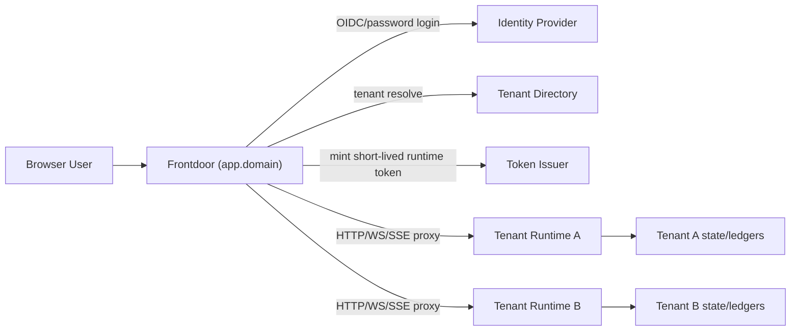

# Hosted Frontdoor + Per-Tenant Runtime

**Status:** IMPLEMENTED (scaffold v1)  
**Last Updated:** 2026-02-20  
**Related:**
- `SINGLE_TENANT_MULTI_USER.md`
- `INGRESS_INTEGRITY.md`
- `CONTROL_PLANE.md`
- `INGRESS_CREDENTIALS.md`
- `INGRESS_CONTROL_PLANE_UNIFICATION_PLAN.md`
- `../iam/ACCESS_CONTROL_SYSTEM.md`

---

## Summary

Nexus hosted mode uses:

1. **One public frontdoor domain** (`app.<domain>`)
2. **One isolated Nexus runtime per tenant/workspace**
3. **One shared control UI shell** served from frontdoor
4. **One IAM model** enforced inside each tenant runtime

Users authenticate at frontdoor (password now, OIDC later), then all control-plane/API/chat traffic is routed to their assigned tenant runtime.

This gives:

- consistent UX (single domain)
- runtime/process/data isolation across businesses
- no cross-tenant credential or agent interference

---

## Implementation Snapshot (2026-02-20)

Frontdoor scaffold is now in-tree:

- `/Users/tyler/nexus/home/projects/nexus/nexus-frontdoor`

Shipped in scaffold v1:

- password login (`/api/auth/login`, `/api/auth/logout`, `/api/auth/session`)
- OIDC authorization-code flow hooks (`/api/auth/oidc/start`, `/api/auth/oidc/callback/:provider`)
- OIDC ID token verification against provider JWKs (`issuer` + `jwksUrl` + signature/claim checks)
- tenant resolution + runtime selection from authenticated principal
- runtime token mint/refresh/revoke (`/api/runtime/token*`)
- HTTP + WS + SSE proxy to tenant runtime via `/runtime/*`
- runtime bearer token injection with canonical hosted claims (`iss`, `aud`, `exp`, `iat`, `jti`, `tenant_id`, `entity_id`, `scopes`, optional roles/session metadata)
- scaffold test coverage for login, token lifecycle, HTTP proxy, and WS proxying

Still pending for production-hardening:

- key rotation strategy for runtime token signing secret
- full hosted Control UI shell integration on this frontdoor surface

Validation additions now in-tree:

- frontdoor OIDC verification tests:
  - `/Users/tyler/nexus/home/projects/nexus/nexus-frontdoor/src/oidc-auth.test.ts`
- frontdoor + runtime live-stack e2e:
  - `/Users/tyler/nexus/home/projects/nexus/nex/src/nex/control-plane/server.frontdoor-live-stack.e2e.test.ts`
- browser smoke e2e (headless Chrome):
  - `/Users/tyler/nexus/home/projects/nexus/nex/src/nex/control-plane/server.frontdoor-browser-smoke.e2e.test.ts`

---

## Goals

- Keep hosted UX simple: one website, one login entrypoint.
- Keep runtime isolation strong: each tenant gets dedicated runtime state and execution boundary.
- Keep Nexus authorization canonical: runtime IAM is still source of truth for control-plane and ingress permissions.
- Support both operator and customer principals in the same hosted surface, with policy-controlled capability differences.

---

## Non-Goals

- True multi-tenant in one Nexus daemon process.
- Embeddable iframe chat or cross-domain widget architecture in v1.
- Bypassing Nexus IAM using frontdoor-only authorization.

---

## High-Level Architecture

---

## Core Components

### 1) Frontdoor

Responsibilities:

- host the control UI shell and static assets
- handle web login/session lifecycle
- resolve user -> tenant runtime destination
- mint signed short-lived runtime tokens/assertions
- reverse proxy control-plane HTTP/WS/SSE to the tenant runtime

Design constraints:

- browser only trusts frontdoor domain
- tenant runtimes are private/internal only
- frontdoor is the only public ingress for hosted control-plane traffic

### 2) Tenant Runtime (Nexus)

Responsibilities:

- verify frontdoor-issued token/assertion
- map claims to runtime principal (`entity_id`, roles/scopes)
- enforce IAM/ACL on control-plane operations
- enforce IAM/ACL through NEX pipeline for adapter ingress events
- persist all audit trails locally to tenant ledgers

Design constraints:

- tenant pinning: runtime only accepts tokens for its configured `tenant_id`
- no local-direct bypass in hosted mode

---

## Canonical User Journey

### A) Login + Route

1. User opens `app.<domain>`.
2. Frontdoor authenticates (password first; OIDC pluggable).
3. Frontdoor resolves tenant assignment.
4. Frontdoor establishes browser session cookie and returns UI shell.

### B) Runtime Session Establishment

1. UI calls frontdoor API.
2. Frontdoor mints short-lived runtime token with tenant + principal claims.
3. Frontdoor proxies request to correct tenant runtime.
4. Runtime verifies token and enforces IAM.

### C) Live Streams (WS/SSE)

1. Browser opens WS/SSE to frontdoor on same domain.
2. Frontdoor proxies to tenant runtime using same routed tenant context.
3. Runtime streams events; frontdoor forwards without cross-tenant mixing.

---

## Token and Session Model

### Browser session (frontdoor)

- HTTP-only secure cookie
- frontdoor-managed
- used to refresh short-lived runtime tokens

### Runtime token (frontdoor -> runtime)

- short TTL (recommended: 5-15 minutes)
- signed assertion/JWT
- includes tenant and principal claims
- audience bound to Nexus runtime

Runtime tokens are transport credentials only; runtime IAM still decides permissions.

---

## Claim Contract (Frontdoor -> Runtime)

Required claims:

- `iss`
- `aud`
- `exp`
- `iat`
- `jti`
- `tenant_id`
- `entity_id`
- `scopes`

Recommended claims:

- `session_id`
- `roles`
- `client_id`
- `amr`

Optional claims:

- `display_name`
- `email`

Rules:

- runtime must not trust caller-supplied identity outside validated claims
- runtime must reject tenant mismatch
- runtime must reject expired/invalid signature tokens

---

## Routing and Isolation Rules

- Every proxied request carries resolved `tenant_id` context.
- Every runtime instance is configured to exactly one tenant/workspace.
- Frontdoor does not allow client-chosen runtime hostnames/IDs.
- Runtime does not accept wildcard tenant claims.

This gives hard tenancy isolation while preserving single-domain UX.

---

## Reusable Frontdoor Scaffold (Template Project)

A dedicated scaffold project is in scope and recommended.

Minimum scaffold modules:

1. `auth-provider/` (password provider + OIDC interface)
2. `tenant-resolver/` (maps user/session to tenant)
3. `runtime-token-issuer/` (JWT/assertion signer)
4. `runtime-proxy/` (HTTP/WS/SSE reverse proxy with sticky routing)
5. `ui-shell/` (hosted control UI static assets)
6. `observability/` (request logs, auth logs, routing logs)

Scaffold acceptance checks:

- user A cannot route to tenant B runtime
- WS/SSE stream isolation by tenant
- revoked session cannot mint fresh runtime tokens

---

## Nexus Fit With Existing Work

This model builds directly on completed Nexus work:

- control-plane IAM taxonomy and authorization exists
- ingress integrity contract exists and remains valid
- ingress credentials model exists
- control-plane/ingress listener split exists conceptually and in partial runtime implementation

Main remaining work is production hardening + full Control UI wiring, not base architecture.

---

## Decision Log (Locked)

1. **Single public domain:** yes
2. **UI shell served from frontdoor:** yes
3. **Per-tenant runtime isolation:** yes
4. **Runtime IAM remains source of truth:** yes
5. **No true multi-tenant daemon for now:** yes

---

## Open Questions (Implementation Detail, Not Direction)

1. Signing key management: static key vs rotating JWK set.
2. Runtime token TTL: 5 minutes vs 15 minutes.
3. Refresh cadence: proactive background refresh vs on-demand refresh.
4. Frontdoor deployment form: standalone service first vs package within Nexus umbrella monorepo.

Direction is already decided; these are tactical implementation knobs.

---

## Implementation Milestones

1. Publish frontdoor scaffold repository in Nexus umbrella. ✅
2. Implement password auth provider in frontdoor + runtime trusted-token verification path. ✅
3. Wire one hosted control UI flow end-to-end (login -> runtime status call -> WS event stream). ⏳
4. Add OIDC provider plugin behind the same frontdoor auth-provider interface. ✅ (flow hooks), hardening pending
5. Add production hardening (key rotation, audit correlation ids, rate limits). ⏳
