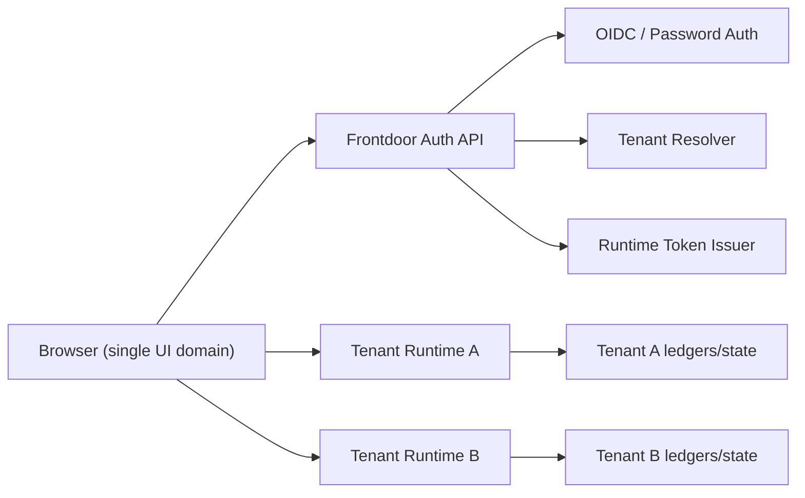

# Hosted Frontdoor -> Direct Browser Runtime Contract

**Status:** DESIGN
**Last Updated:** 2026-02-27  
**Related:**
- `../_archive/HOSTED_FRONTDOOR_PER_TENANT_RUNTIME.md`
- `HOSTED_RUNTIME_PROFILE.md`
- `../ingress/SINGLE_TENANT_MULTI_USER.md`
- `../ingress/INGRESS_INTEGRITY.md`
- `../ingress/CONTROL_PLANE_AUTHZ_TAXONOMY.md`

---

## Summary

Hosted Nexus uses:

1. one public frontdoor (`app.<domain>`) for login/session orchestration
2. one isolated runtime per tenant/workspace
3. direct browser -> tenant runtime control-plane connection (this document describes that profile)

This keeps tenant execution/data isolated while preserving a single user-facing website entrypoint.

Alignment note:

1. For product app onboarding/launch flows, frontdoor-routed app/runtime paths may be canonical.
2. This document remains authoritative for the direct-mode profile only.

---

## Decision (Profile-Scoped)

Connection mode for hosted control-plane is **direct**:

- browser authenticates to frontdoor
- frontdoor mints short-lived runtime bearer token
- browser calls tenant runtime HTTP/WS/SSE directly with that token

Frontdoor runtime proxy routes (`/runtime/*`, `/app/*`) remain valid in frontdoor-routed product flows; this direct-mode profile does not supersede that architecture choice.

---

## Topology



---

## Trust Boundaries

1. **Frontdoor session boundary**
   - Frontdoor owns login/auth/session cookies.
   - Browser never chooses `tenant_id`, `entity_id`, or runtime host directly.
2. **Runtime auth boundary**
   - Runtime trusts only verified frontdoor token claims.
   - Runtime IAM remains authorization source of truth.
3. **Tenant isolation boundary**
   - One runtime per tenant.
   - Token `tenant_id` must match runtime configured tenant.

---

## Canonical URL Model

Example:

- Frontdoor UI/API origin: `https://app.example.com`
- Tenant runtime origin: `https://rt-tenant-abc.example.com`

The browser may be served from frontdoor while calling runtime cross-origin; runtime must explicitly allow trusted UI origins (CORS + WS origin allowlist).

---

## End-To-End Flow

1. Browser loads UI shell from frontdoor.
2. User logs in at frontdoor (`password` now, `OIDC` pluggable).
3. Browser requests runtime token from frontdoor.
4. Frontdoor resolves tenant and returns:
   - short-lived access token
   - refresh token
   - runtime endpoint descriptor (HTTP/WS/SSE URLs)
5. Browser connects directly to runtime using `Authorization: Bearer <access_token>` for HTTP/SSE and `connect.auth.token` for WS.
6. Runtime verifies claims, enforces tenant pinning, then IAM-authorizes operations.
7. Browser refreshes token through frontdoor as needed.
8. Logout revokes session + refresh tokens and clears frontdoor cookie.

---

## Frontdoor API Contracts

All payloads are JSON unless stated otherwise.

### `POST /api/auth/login`

Request:

```json
{
  "username": "owner",
  "password": "secret"
}
```

Response `200`:

```json
{
  "ok": true,
  "authenticated": true,
  "session_id": "fd_sess_x",
  "tenant_id": "tenant-dev",
  "entity_id": "entity-owner",
  "roles": ["operator"],
  "scopes": ["*"]
}
```

Errors:

- `401 invalid_credentials`
- `429 login_rate_limited`

### `GET /api/auth/session`

Response (authenticated):

```json
{
  "authenticated": true,
  "session_id": "fd_sess_x",
  "tenant_id": "tenant-dev",
  "entity_id": "entity-owner",
  "username": "owner",
  "display_name": "Owner",
  "email": "owner@example.com",
  "roles": ["operator"],
  "scopes": ["*"]
}
```

Response (anonymous):

```json
{
  "authenticated": false
}
```

### `POST /api/auth/logout`

Response:

```json
{
  "ok": true
}
```

### `GET /api/auth/oidc/start?provider=<id>&return_to=/...`

- Starts OIDC auth code flow.
- Response: `302` redirect to provider authorize URL.

### `GET /api/auth/oidc/callback/<provider>?code=...&state=...`

- Completes OIDC flow, creates frontdoor session, redirects browser (`302`) to `return_to` or `/`.

### `POST /api/runtime/token`

Purpose:

- Mint runtime access/refresh token pair for the authenticated frontdoor session.
- Return runtime endpoints for direct browser connection in this profile.

Request:

```json
{
  "client_id": "nexus-control-ui"
}
```

`client_id` is optional; if omitted, frontdoor default applies.

Response `200`:

```json
{
  "ok": true,
  "access_token": "<jwt>",
  "token_type": "Bearer",
  "expires_in": 600,
  "key_id": "v1",
  "refresh_token": "<opaque>",
  "refresh_expires_in": 2592000,
  "tenant_id": "tenant-dev",
  "entity_id": "entity-owner",
  "scopes": ["*"],
  "roles": ["operator"],
  "runtime": {
    "tenant_id": "tenant-dev",
    "base_url": "https://rt-tenant-dev.example.com",
    "http_base_url": "https://rt-tenant-dev.example.com",
    "ws_url": "wss://rt-tenant-dev.example.com/",
    "sse_url": "https://rt-tenant-dev.example.com/api/events/stream"
  }
}
```

Errors:

- `401 unauthorized`
- `429 token_rate_limited`

### `POST /api/runtime/token/refresh`

Request:

```json
{
  "refresh_token": "<opaque>"
}
```

Response `200`: same schema as `/api/runtime/token` with rotated `refresh_token`.

Errors:

- `400 missing_refresh_token`
- `401 invalid_refresh_token`
- `429 token_rate_limited`

### `POST /api/runtime/token/revoke`

Request:

```json
{
  "refresh_token": "<opaque>"
}
```

Response:

```json
{
  "ok": true
}
```

If token not found, response is `404` with `{ "ok": false }`.

---

## Runtime HTTP/WS/SSE Contracts

### Auth transport

- HTTP/SSE: `Authorization: Bearer <frontdoor runtime token>`
- WS: `connect` frame must include `auth.token` (browser cannot reliably set `Authorization` header for WS in all clients)

### Control-plane HTTP examples

- `GET /health`
- `GET /api/events/stream?types=<comma-separated>`

Both require valid token in hosted mode.

### WS connect frame

```json
{
  "type": "req",
  "id": "connect-1",
  "method": "connect",
  "params": {
    "minProtocol": 1,
    "maxProtocol": 1,
    "client": {
      "id": "control-ui",
      "version": "1.0.0",
      "platform": "web",
      "mode": "control"
    },
    "auth": {
      "token": "<frontdoor runtime token>"
    }
  }
}
```

Runtime response is standard `hello-ok` protocol response on success.

---

## Schema Fields

### Runtime token claims (frontdoor-signed JWT)

Required:

- `iss`
- `aud`
- `exp`
- `iat`
- `jti`
- `tenant_id`
- `entity_id` (or `sub`, with runtime mapping to `entity_id`)
- `scopes`

Recommended:

- `roles`
- `session_id`
- `client_id`
- `amr`

Optional:

- `display_name`
- `email`

Runtime validation rules:

1. signature/alg must verify against trusted frontdoor keys
2. `iss` and `aud` must match runtime config
3. `tenant_id` must equal runtime configured tenant
4. token time claims (`exp`, `iat`, optional `nbf`) must be valid with bounded skew
5. `jti` replay policy must be enforced
6. runtime must ignore caller-supplied identity hints outside claims

### Runtime descriptor schema

```ts
type RuntimeDescriptor = {
  tenant_id: string;
  base_url: string;
  http_base_url: string;
  ws_url: string;
  sse_url: string;
};
```

### Runtime token response schema

```ts
type RuntimeTokenResponse = {
  ok: true;
  access_token: string;
  token_type: "Bearer";
  expires_in: number;
  key_id?: string;
  refresh_token: string;
  refresh_expires_in: number;
  tenant_id: string;
  entity_id: string;
  scopes: string[];
  roles: string[];
  runtime: RuntimeDescriptor;
};
```

### Error schema

```ts
type ErrorResponse = {
  ok: false;
  error: string;
  retry_after_seconds?: number | null;
};
```

---

## CORS + Origin Policy (Required For Direct Mode)

Runtime must enforce both:

1. **HTTP CORS allowlist**
   - Allow only configured frontdoor/product UI origins.
   - Allow `Authorization` header.
   - Deny wildcard origins in hosted mode.
2. **WS origin allowlist**
   - Existing browser origin checks must include frontdoor/product UI origin(s).
   - Reject unknown origins before handshake completion.

This is mandatory for browser safety when UI origin and runtime origin differ.

---

## Invariants

1. Browser cannot choose `tenant_id`; frontdoor resolves tenant from authenticated principal.
2. Browser cannot choose `entity_id`; runtime identity is token-derived.
3. Runtime IAM still authorizes each operation (control-plane direct authorize + pipeline IAM for events).
4. Only internal runtime sources (`clock`, `boot`, `restart`) may use system principal.
5. Frontdoor and runtime must both log auth decisions and denials with correlation IDs.

---

## Cutover Requirements

1. Extend `/api/runtime/token*` responses with `runtime` descriptor fields.
2. Add runtime hosted CORS config and enforcement for allowed UI origins.
3. Set control UI client to consume direct runtime URLs/tokens (instead of `/runtime/*` proxy paths).
4. Keep `/runtime/*` proxy compatibility available where product flows require frontdoor-routed transport.

---

## Validation Matrix

1. Login -> `/api/runtime/token` -> direct `GET <runtime>/health` succeeds.
2. Direct WS connect with token succeeds; without token fails.
3. Direct SSE stream with token succeeds; without token fails.
4. Token with wrong `tenant_id` fails against runtime.
5. Forged body identity fields do not change runtime principal.
6. Runtime rejects disallowed browser origins (HTTP CORS + WS origin check).
7. Revoked refresh token cannot mint new runtime token.
8. Cross-tenant token misuse fails (tenant A token against tenant B runtime).
