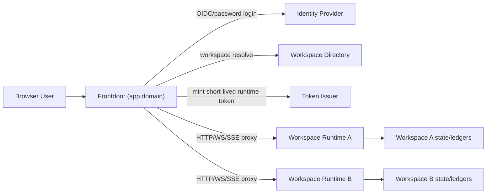

# Hosted Runtime Profile (Per-Tenant Nexus)

**Status:** IMPLEMENTED (runtime-side v1 + hosted frontdoor hardening v2)  
**Last Updated:** 2026-02-20  
**Related:**
- `HOSTED_DIRECT_BROWSER_RUNTIME_CONTRACT.md`
- `HOSTED_MULTI_WORKSPACE.md`
- `../ingress/SINGLE_TENANT_MULTI_USER.md`
- `../ingress/INGRESS_INTEGRITY.md`
- `../ingress/CONTROL_PLANE_AUTHZ_TAXONOMY.md`
- `../workplans/INGRESS_CONTROL_PLANE_UNIFICATION_PLAN.md`

---

## Purpose

Define exactly what Nexus runtime must enforce to safely run behind a hosted frontdoor with one runtime per tenant.

This document explicitly separates:

- what is already implemented
- what remains to implement
- the normative behavior in hosted mode

---

## Hosted Mode Invariants

In hosted mode, runtime must obey all of the following:

1. every control-plane request is authenticated and IAM-authorized
2. every agent-triggering ingress path enters NEX as `NexusEvent`
3. principal identity is derived from verified credentials/claims, never request body identity hints
4. only minimal internal event sources may use `system` principal (`clock`, `boot`, `restart`)
5. tenant claim must match runtime tenant configuration

---

## Current State Mapping

### Already Implemented

- control-plane authz taxonomy (`control.<resource>.<action`) exists
- control-plane IAM authorization path exists for WS and HTTP operations (including `tools.invoke` and canvas/browser HTTP/WS surfaces)
- control-plane username/password login exists
- ingress credentials lifecycle exists (list/create/revoke/rotate)
- ingress integrity enforcement exists (stamping + reserved platform rules + integrity telemetry)
- ingress credential role-tag synchronization exists
- trusted-token runtime auth mode (`runtime.auth.mode=trusted_token`) with claim verification
- hosted-mode startup hardening gates (`runtime.hostedMode` + `runtime.tenantId` + verifier required)
- strict tenant pinning (`tenant_id` claim must match runtime tenant)
- hosted-mode HTTP/WS behavior gates (no local-direct bypass, `/api/auth/login` disabled)
- hosted-mode regression suite covering startup guards + HTTP/WS auth behavior

### Remaining For Hosted Readiness

1. production key management and signing-key rotation strategy
2. full hosted Control UI integration through frontdoor (beyond scaffold shell)

---

## Runtime Auth Modes

### Local mode (existing)

- optimized for loopback/local owner workflows
- may include local-direct conveniences

### Hosted mode (target profile)

- frontdoor-authenticated only
- no local-direct bypass
- no unauthenticated control-plane HTTP/WS/SSE
- tenant claim mandatory
- token verification mandatory

Hosted mode is a strict profile, not a new runtime architecture.

---

## Trusted-Token Mode Spec

Runtime must support an auth verifier plugin for frontdoor tokens.

Validation requirements:

- verify signature
- verify `iss`
- verify `aud`
- verify `exp`/`iat` (and optional `nbf`)
- enforce `jti` replay mitigation policy (at least bounded recent cache)
- require and validate `tenant_id`
- require and validate `entity_id`

On success, runtime binds connection/request principal from claims:

- `principal.entity_id <- token.entity_id`
- runtime scopes/roles <- token scopes/roles
- runtime session metadata <- token.session_id (if present)

On failure, runtime rejects request before method dispatch.

---

## Canonical Claims Contract

Required:

- `iss`
- `aud`
- `exp`
- `iat`
- `jti`
- `tenant_id`
- `entity_id`
- `scopes`

Recommended:

- `session_id`
- `roles`
- `client_id`
- `amr`

Optional:

- `display_name`
- `email`

Rules:

- claims are authoritative identity context
- request payload identity hints are never authoritative
- runtime must reject token if `tenant_id` mismatches configured tenant

---

## Hosted Hardening Requirements

When `runtime.hosted_mode=true`:

1. disable local-direct request bypass for control-plane HTTP endpoints
2. require AuthN for control-plane WS handshake
3. require AuthN for control-plane SSE stream
4. require IAM authorization per control-plane operation taxonomy
5. forbid wildcard/system fallbacks for non-internal ingress channels

This can be implemented as one profile gate with fail-fast startup checks.

---

## Control-Plane IAM Parity

Normative rule:

- no control-plane operation is allowed to rely only on token scopes without IAM policy evaluation

Implementation guardrails:

- all WS methods are taxonomy-backed and IAM-evaluated
- all control-plane HTTP operation methods map to taxonomy entries and IAM authorization
- regression tests must fail on any added method missing taxonomy/IAM integration

---

## Ingress Integrity Contract (Applies Unchanged)

The existing integrity spec remains canonical and applies directly in hosted mode:

- daemon-stamped authoritative fields
- reserved platform protection
- adapter account/platform bounds
- token-derived principal mapping
- ingress integrity violation audit + bus events

No net-new identity bypasses are introduced by frontdoor when trusted-token mode is used correctly.

---

## Runtime Configuration Surface (Proposed)

```yaml
runtime:
  hosted_mode: true
  tenant_id: "tenant_abc"
  auth:
    mode: "trusted_token"
    trusted_token:
      issuer: "https://app.example.com"
      audience: "nexus-runtime"
      jwks_url: "https://app.example.com/.well-known/jwks.json"
      clock_skew_seconds: 60
      require_jti: true
```

Notes:

- exact key names can change; behavior requirements cannot
- runtime must fail startup when hosted mode is enabled without valid trusted-token verifier config

---

## Decision Points (Locked)

1. **Use direct IAM authorize for control-plane ops (not NexusEvent pipeline):** locked
2. **Principal source in hosted mode is token claims from trusted frontdoor:** locked
3. **Ingress integrity contract carries forward unchanged:** locked
4. **System principal reserved for internal sources only:** locked

---

## Tactical Decision Points (Choose During Implementation)

1. JTI replay strategy: in-memory LRU vs persistent short-term store
2. JWKS refresh strategy: polling vs cache-on-miss with backoff
3. Token TTL default: 5 minutes vs 15 minutes
4. Hosted mode config naming finalization

These do not change architecture direction.

---

## Validation Matrix

Required automated checks:

1. valid token + tenant match -> allow subject to IAM
2. valid token + tenant mismatch -> deny
3. expired token -> deny
4. invalid signature -> deny
5. HTTP identity hint spoof (`user`, sender hints) does not alter principal
6. control-plane HTTP endpoint without token in hosted mode -> deny
7. WS connect without token in hosted mode -> deny
8. reserved platform claim from external ingress -> deny + integrity audit event

Validation snapshot (2026-02-20):

- `src/nex/control-plane/auth.test.ts`
- `src/nex/control-plane/server.hosted-mode.e2e.test.ts`
- `src/nex/control-plane/server.auth.login.e2e.test.ts`
- `src/nex/control-plane/server.health.e2e.test.ts`
- `src/nex/control-plane/server.nex-http.e2e.test.ts`
- `src/nex/control-plane/server.ingress-cutover.e2e.test.ts`
- `src/nex/control-plane/server.ingress-credentials.e2e.test.ts`
- `/Users/tyler/nexus/home/projects/nexus/nexus-frontdoor/src/server.test.ts`
- `/Users/tyler/nexus/home/projects/nexus/nexus-frontdoor/src/oidc-auth.test.ts`
- `src/nex/control-plane/server.frontdoor-live-stack.e2e.test.ts`
- `src/nex/control-plane/server.frontdoor-browser-smoke.e2e.test.ts`

These suites pass together for hosted/runtime profile coverage.

---

## Implementation Order

1. add trusted-token verifier interface and implementation ✅
2. add hosted_mode profile gate + startup validation ✅
3. close remaining control-plane HTTP IAM parity gaps for hosted profile endpoints ✅
4. add hosted-mode auth regression suite ✅
5. integrate with frontdoor scaffold for end-to-end tests ✅ (scaffold-local coverage), expand into Nexus hosted CI matrix ⏳

---

## High-Level Architecture



---

## Frontdoor Scaffold Modules

The frontdoor scaffold project (`nexus-frontdoor`) provides:

1. `auth-provider/` — password provider + OIDC interface
2. `tenant-resolver/` — maps user/session to workspace
3. `runtime-token-issuer/` — JWT/assertion signer
4. `runtime-proxy/` — HTTP/WS/SSE reverse proxy with sticky routing
5. `ui-shell/` — hosted control UI static assets
6. `observability/` — request logs, auth logs, routing logs

See `HOSTED_DIRECT_BROWSER_RUNTIME_CONTRACT.md` for the API contract and `HOSTED_MULTI_WORKSPACE.md` for the multi-workspace data model.
