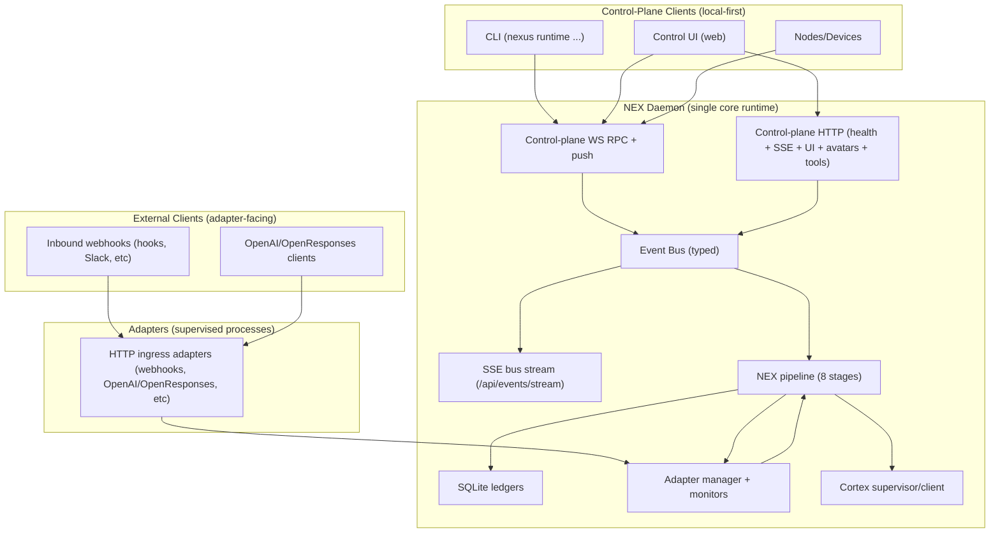

# NEX Control Plane (Gateway Removal)

**Status:** DESIGN SPEC  
**Last Updated:** 2026-02-13  
**Related:** DAEMON.md, BUS_ARCHITECTURE.md, NEX.md, NEXUS_REQUEST.md, SINGLE_TENANT_MULTI_USER.md, ../../environment/interface/cli/COMMANDS.md, ../../environment/foundation/RUNTIME_REALIGNMENT_DECISIONS.md

---

## Overview

Nexus runs as **one** long-running process: the **NEX daemon**.

There is no separate "gateway" daemon/service.

The NEX daemon includes the **control-plane** (formerly implemented as `src/gateway/`):

- WebSocket RPC (CLI + Control UI + nodes/devices)
- Control-plane HTTP endpoints (health, SSE bus stream, UI hosting, avatars, privileged tool services)
- Discovery/exposure (LAN/Tailnet) for the control-plane when enabled
- Operational lifecycle (PID lock, hot reload, graceful shutdown)

**External ingress is not part of the control-plane HTTP surface.** Protocol bridges that accept inbound traffic from the outside world (hooks webhooks, Slack inbound, OpenAI/OpenResponses compatibility, etc) are implemented as **NEX adapters** (process-managed ingress points) and must emit `NexusEvent`s into the NEX pipeline.

This spec defines the target unification and the migration work required to complete it.

---

## Goals

- **Single core runtime**: one NEX daemon owns the NEX pipeline and the control-plane server.
- **Local-first privileged control-plane**: bind on loopback by default; remote exposure requires strict auth.
- **Single control-plane port**: one bind host/port for control-plane HTTP + WS (and SSE on the same server).
- **Adapters own external ingress**: all non-control-plane protocol bridges are supervised adapters (no in-daemon exceptions).
- **Single IAM boundary**: nothing that runs an agent bypasses `receiveEvent -> resolveAccess -> ...`; approvals/permissions are enforced and audited by IAM.
- **Single source of truth**: control-plane operations act through NEX primitives (bus, ledgers, adapters, pipeline), not parallel code paths.
- **Terminology**: "gateway" is non-canonical; use **runtime** / **control-plane**.

---

## Non-Goals

- Backward compatibility with upstream OpenClaw gateway binaries or contracts.
- Preserving "gateway" CLI command group or config namespaces.
- Keeping `src/gateway/` as a separate runtime server.
- Hosting external protocol ingress (hooks/OpenAI/OpenResponses/etc) directly inside the control-plane HTTP router.

---

## Current State (Implementation Snapshot)

Today `nex` contains **two** server concepts:

1. `src/nex/daemon.ts` (NEX daemon)
   - Owns: ledgers, event bus, plugins, pipeline, cortex supervision, adapter manager, SSE.
   - HTTP surface is currently small (health + SSE + a few service endpoints).

2. `src/gateway/` (legacy control-plane server)
   - Owns: WebSocket RPC methods, Control UI hosting, OpenAI/OpenResponses HTTP bridges, tools invoke endpoint, hooks endpoint, discovery/tailscale, node/device pairing, cron, approvals, etc.
   - Executes agent turns via legacy command-style entrypoints rather than the NEX pipeline.

This split is a primary source of drift and confusion. The goal is to delete (2) as a separate server by migrating its capabilities into the NEX daemon.

---

## Target Architecture



---

## Control-Plane Surfaces (What Moves Into NEX)

### WebSocket (RPC + Push)

The daemon provides a WS interface for:

- authenticated client connections (CLI/UI/nodes/devices)
- request/response RPC method calls
- push events (system status, approvals, pairing, streaming status, etc)

The simplest migration is to reuse the existing WS RPC protocol and method handlers, but re-home them under NEX as the canonical control-plane.

### HTTP

The **control-plane** HTTP server includes:

- Health: `GET /health`
- Bus SSE: `GET /api/events/stream`
- Control UI hosting (configurable base path)
- Avatars/media endpoints required by the Control UI
- Tools invoke: `POST /tools/invoke` (privileged, IAM-authorized + audited)

**Not control-plane:** inbound protocol bridges (hooks webhooks, Slack inbound, OpenAI/OpenResponses API compatibility, etc). Those are implemented as adapters.

---

## Ingress Adapters (Protocol Bridges)

Any inbound integration that is not the local control-plane must be implemented as a NEX adapter.

Normative requirements:

- Adapter accepts inbound protocol traffic.
- Adapter normalizes inbound traffic to a `NexusEvent` and emits it into the NEX pipeline.
- Adapter receives outbound delivery via adapter `send`/`stream` and translates it back to the protocol.
- Adapter never bypasses IAM: the daemon evaluates access in `resolveAccess` and logs audit entries for the resulting work.

Expected built-in adapters (names are illustrative):

- **HTTP Webhook Adapter**: receives hook webhooks and emits `NexusEvent`s.
- **OpenAI Compatibility Adapter**: serves `/v1/chat/completions` (+ SSE streaming) and emits `NexusEvent`s.
- **OpenResponses Compatibility Adapter**: serves `/v1/responses` (+ SSE streaming) and emits `NexusEvent`s.
- **Slack/Discord/etc inbound bridges**: adapters per channel as needed.

These adapters are supervised by the daemon’s adapter manager (health, restart, status, logs).

---

## Critical Unification Requirement: One Agent Execution Path

A unified daemon only makes sense if inbound HTTP/WS actions flow through NEX consistently.

Normative behavior:

- Anything that "runs an agent" must create a `NexusEvent` and enter the NEX pipeline via `receiveEvent`.
- Streaming to clients must be expressed as NEX `StreamEvent` / bus events, then adapted to the caller (WS push or SSE frames).

Anti-pattern (to remove):

- "control-plane endpoint directly calls legacy `agentCommand`/CLI runner" bypassing NEX pipeline stages (access control, hooks, audit, tracing).

---

## Exec Approvals: Replace with IAM (Rip Out ExecApprovalManager)

The legacy exec approval system (file-based allowlists + `exec.approval.*` WS RPC) must be removed and replaced by IAM:

Legacy (to delete):

- `~/nexus/state/exec-approvals.json` allowlist file
- `exec.approval.request` / `exec.approval.resolve` RPC methods
- `exec.approvals.*` RPC methods for reading/writing approval allowlists
- any forwarding-only infrastructure dedicated to exec approvals

Target behavior:

- Tool execution is authorized by IAM policies + grants (via `resolveAccess` outputs and/or explicit IAM checks).
- When a tool requires approval, the daemon creates an `acl_permission_requests` row and publishes:
  - `permission.requested` bus event (for UI/CLI)
- Approval/denial is performed through canonical IAM surfaces:
  - CLI: `nexus acl request list/show/approve/deny`
  - Control UI: pending approvals list + actions
- Approval outcomes:
  - **allow once**: approve the request without creating a standing grant
  - **allow always**: approve and create a grant (optionally time-bounded)
- All approvals and resulting tool executions are audited in the IAM audit log.

This makes approvals uniform across *all* sensitive actions, not just `exec`.

---

## Migration Work Breakdown (Big Bang)

This is a single cutover change set. The order below is implementation sequencing, not incremental compatibility.

### 1. Embed Control-Plane Server Into NEX Daemon

- Add a `control-plane` module under `src/nex/` that exposes:
  - `startControlPlaneServer({ nex, bus, ledgers, config, ... }) -> handle`
  - unified bind/port and shutdown wiring
- Update daemon startup sequence so that:
  - the HTTP server is created once and hosts all endpoints (UI + hooks + APIs + SSE)
  - the WS server is attached to the same HTTP server (upgrade handler)

### 2. Move WS RPC Protocol + Handlers

Migrate from `src/gateway/` into `src/nex/control-plane/`:

- protocol types + frame parsing
- connection/auth handshake
- method dispatch
- method handler modules by domain (config, sessions, nodes, etc)
- push-event broadcaster

### 3. Migrate HTTP Endpoints

Migrate HTTP handlers into NEX control-plane:

- tools invoke handler
- Control UI hosting + avatar endpoint(s)
- any remaining inbound endpoints still considered canonical

Move any inbound protocol bridges (hooks/OpenAI/OpenResponses/etc) out of the control-plane and into adapter processes.

### 4. Rewrite "Agent Run" Endpoints to Use NEX Pipeline

Update WS and HTTP surfaces that currently "run agent" to:

- construct a `NexusEvent` (with delivery context for the surface)
- run it through NEX pipeline
- surface streaming via:
  - WS push events (preferred for UI + CLI)
  - adapter `stream` for protocol bridges (OpenAI/OpenResponses/etc)

### 5. Switch CLI/Control UI to NEX Daemon as the Only Server

- CLI "runtime" commands connect to the daemon directly.
- Remove any assumptions that a separate gateway service exists.
- Ensure service management (`nexus daemon ...`) controls only this daemon.

### 6. Delete Gateway-as-a-Server

- Remove `startGatewayServer()` as a production runtime entrypoint.
- Delete dead code paths and their tests.
- Keep only control-plane code as part of NEX daemon.

---

## File/Module Mapping (Implementation Guidance)

This is a suggested destination layout, not a strict requirement:

```
src/nex/control-plane/
├── server.ts                   # startControlPlaneServer()
├── http/
│   ├── router.ts               # HTTP routing
│   ├── health.ts               # /health
│   ├── events-stream.ts        # /api/events/stream
│   ├── tools-invoke.ts         # /tools/invoke (privileged)
│   └── ui.ts                   # Control UI + avatars
├── ws/
│   ├── server.ts               # WS server + upgrade
│   ├── connection.ts           # connect handshake + auth
│   ├── dispatch.ts             # method dispatch
│   └── broadcast.ts            # push events
├── rpc/
│   ├── protocol/               # frame schemas + error codes
│   ├── methods/                # per-domain method handlers
│   └── methods-list.ts         # method list + push-event list
└── auth/
    ├── auth.ts                 # token/password/device auth
    ├── origin-check.ts
    └── device-auth.ts

src/nex/adapters/
├── http-webhook/               # webhook ingress adapter
├── openai-compat/              # OpenAI API compatibility adapter
└── openresponses-compat/       # OpenResponses API compatibility adapter
```

---

## Acceptance Criteria

This spec is implemented when all are true:

- Only one long-running process is required: `nexus daemon start`.
- Control UI loads from the NEX daemon HTTP server and connects via WS.
- `nexus runtime status/health/call/...` work with no gateway service running.
- Hooks webhooks can trigger agent work through the NEX pipeline **via an ingress adapter**.
- OpenAI/OpenResponses endpoints (if enabled) work end-to-end **via adapters** and route through the NEX pipeline.
- Bus SSE stream continues to work at `GET /api/events/stream`.
- Exec approvals are handled via IAM permission requests/grants (no `exec.approval.*` RPC and no `exec-approvals.json` allowlist in the production path).
- No production code depends on `src/gateway/` as a separate server concept.
