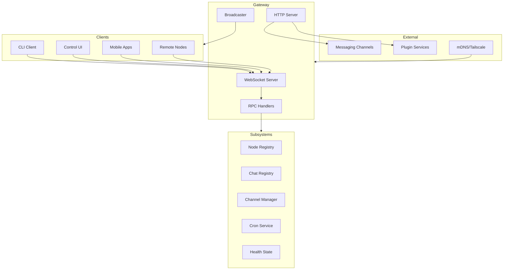
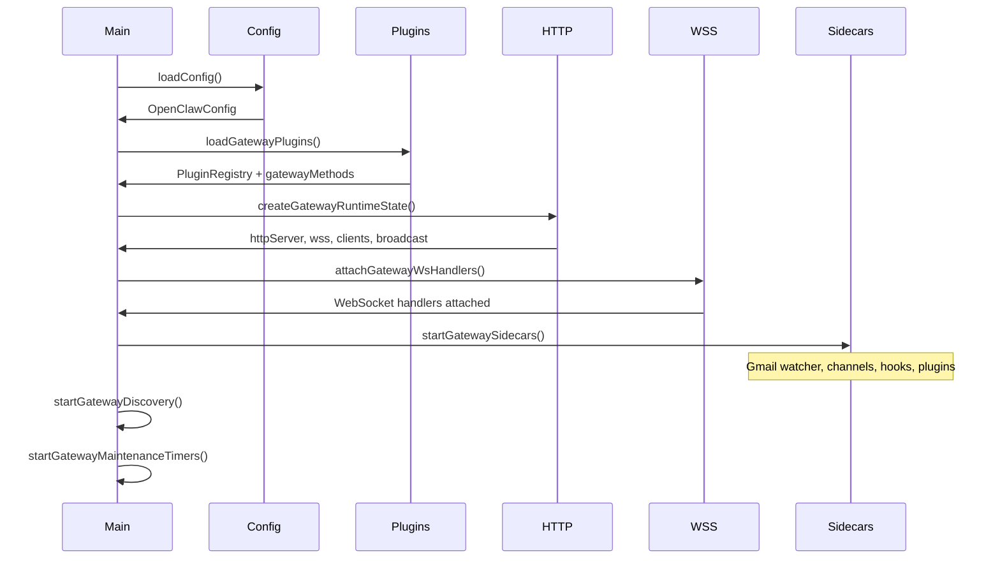
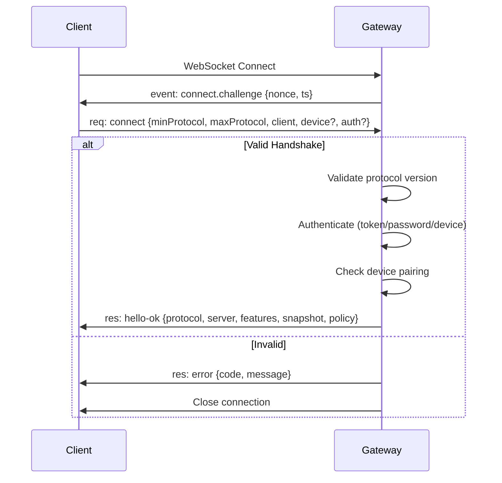
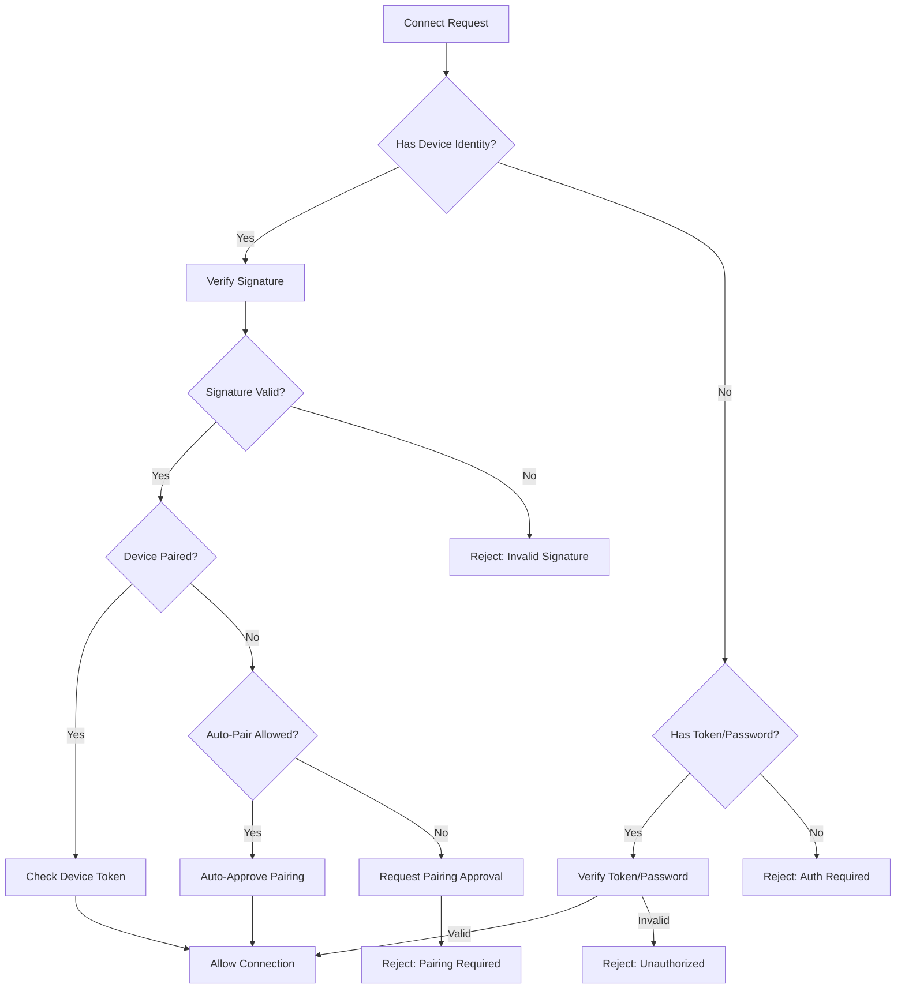

# OpenClaw Gateway Server Architecture

This document provides a comprehensive reference for the OpenClaw Gateway server, which serves as the central hub for WebSocket/HTTP communication between clients (Control UI, CLI, mobile apps, nodes) and the agent runtime.

**Source Location:** `src/gateway/`

---

## Table of Contents

1. [Server Architecture](#server-architecture)
2. [Boot and Initialization](#boot-and-initialization)
3. [Protocol](#protocol)
4. [RPC Methods](#rpc-methods)
5. [Event System](#event-system)
6. [Key Subsystems](#key-subsystems)
7. [HTTP Endpoints](#http-endpoints)
8. [Authentication](#authentication)
9. [Code Reference](#code-reference)

---

## Server Architecture

### High-Level Overview



### Core Components

| Component | File | Purpose |
|-----------|------|---------|
| Entry Point | `server.ts` | Exports `startGatewayServer()` |
| Implementation | `server.impl.ts` | Main server setup and lifecycle |
| Runtime State | `server-runtime-state.ts` | Creates HTTP, WebSocket, and shared state |
| Sidecars | `server-startup.ts` | Starts Gmail watcher, channels, plugins |
| WS Connection | `server/ws-connection.ts` | WebSocket connection handling |
| Message Handler | `server/ws-connection/message-handler.ts` | Frame parsing and routing |
| HTTP Server | `server-http.ts` | HTTP request handling |
| Broadcast | `server-broadcast.ts` | Event broadcasting to all clients |

### Server Constants

From `server-constants.ts`:

| Constant | Value | Purpose |
|----------|-------|---------|
| `MAX_PAYLOAD_BYTES` | 512 KB | Maximum incoming frame size |
| `MAX_BUFFERED_BYTES` | 1.5 MB | Per-connection send buffer limit |
| `TICK_INTERVAL_MS` | 30,000 ms | Heartbeat tick interval |
| `HEALTH_REFRESH_INTERVAL_MS` | 60,000 ms | Health snapshot refresh interval |
| `DEDUPE_TTL_MS` | 300,000 ms | Deduplication entry TTL |
| `DEDUPE_MAX` | 1,000 | Maximum deduplication entries |
| `HANDSHAKE_TIMEOUT_MS` | 10,000 ms | WebSocket handshake timeout |

---

## Boot and Initialization

### Startup Sequence



### Key Initialization Functions

**`startGatewayServer(port, opts)`** in `server.impl.ts`:

1. **Config Loading**: Reads and validates `~/.openclaw/config.toml`
2. **Plugin Loading**: Loads plugins via `loadGatewayPlugins()`
3. **Runtime Config**: Resolves bind host, auth, TLS settings
4. **Control UI**: Ensures assets built if enabled
5. **TLS**: Loads TLS runtime if configured
6. **Runtime State**: Creates HTTP server, WebSocket server, broadcasters
7. **Node Registry**: Initializes for tracking connected nodes
8. **Channel Manager**: Sets up messaging channel lifecycle
9. **Discovery**: Starts mDNS/Bonjour and Tailscale exposure
10. **Maintenance Timers**: Health checks, presence updates, cleanup
11. **WebSocket Handlers**: Attaches connection and message handlers
12. **Sidecars**: Starts Gmail watcher, channels, plugins, hooks

### GatewayServerOptions

```typescript
type GatewayServerOptions = {
  bind?: "loopback" | "lan" | "tailnet" | "auto";
  host?: string;  // Direct bind host override
  controlUiEnabled?: boolean;
  openAiChatCompletionsEnabled?: boolean;
  openResponsesEnabled?: boolean;
  auth?: GatewayAuthConfig;
  tailscale?: GatewayTailscaleConfig;
};
```

---

## Protocol

### Protocol Version

Current version: **PROTOCOL_VERSION** (negotiated during connect handshake)

### Frame Types

All communication uses JSON frames over WebSocket. Three frame types:

#### 1. Request Frame (`type: "req"`)

```typescript
type RequestFrame = {
  type: "req";
  id: string;           // Unique request ID for correlation
  method: string;       // RPC method name
  params?: unknown;     // Method-specific parameters
};
```

#### 2. Response Frame (`type: "res"`)

```typescript
type ResponseFrame = {
  type: "res";
  id: string;           // Matches request ID
  ok: boolean;          // Success indicator
  payload?: unknown;    // Response data if ok=true
  error?: ErrorShape;   // Error details if ok=false
};

type ErrorShape = {
  code: string;         // Error code (see ErrorCodes)
  message: string;      // Human-readable message
  details?: unknown;    // Additional context
  retryable?: boolean;
  retryAfterMs?: number;
};
```

#### 3. Event Frame (`type: "event"`)

```typescript
type EventFrame = {
  type: "event";
  event: string;        // Event name
  payload?: unknown;    // Event data
  seq?: number;         // Sequence number for ordering
  stateVersion?: {      // State versioning
    presence?: number;
    health?: number;
  };
};
```

### Error Codes

From `protocol/schema/error-codes.ts`:

| Code | Description |
|------|-------------|
| `NOT_LINKED` | Resource not linked |
| `NOT_PAIRED` | Device/node not paired |
| `AGENT_TIMEOUT` | Agent response timeout |
| `INVALID_REQUEST` | Invalid request parameters |
| `UNAVAILABLE` | Service unavailable |

### Connection Handshake



### Connect Parameters

```typescript
type ConnectParams = {
  minProtocol: number;
  maxProtocol: number;
  client: {
    id: string;            // Client identifier
    displayName?: string;
    version: string;
    platform: string;
    deviceFamily?: string;
    modelIdentifier?: string;
    mode: string;          // "cli" | "control-ui" | "webchat" | etc.
    instanceId?: string;
  };
  caps?: string[];         // Client capabilities
  commands?: string[];     // Supported commands (for nodes)
  permissions?: Record<string, boolean>;
  pathEnv?: string;
  role?: "operator" | "node";
  scopes?: string[];       // Permission scopes
  device?: {               // Device identity (for secure auth)
    id: string;
    publicKey: string;
    signature: string;
    signedAt: number;
    nonce?: string;
  };
  auth?: {
    token?: string;
    password?: string;
  };
  locale?: string;
  userAgent?: string;
};
```

### Hello-OK Response

```typescript
type HelloOk = {
  type: "hello-ok";
  protocol: number;
  server: {
    version: string;
    commit?: string;
    host?: string;
    connId: string;
  };
  features: {
    methods: string[];     // Available RPC methods
    events: string[];      // Subscribable events
  };
  snapshot: Snapshot;      // Initial state snapshot
  canvasHostUrl?: string;
  auth?: {                 // Device token if applicable
    deviceToken: string;
    role: string;
    scopes: string[];
    issuedAtMs?: number;
  };
  policy: {
    maxPayload: number;
    maxBufferedBytes: number;
    tickIntervalMs: number;
  };
};
```

### Snapshot Schema

```typescript
type Snapshot = {
  presence: PresenceEntry[];
  health: HealthSummary | null;
  stateVersion: {
    presence: number;
    health: number;
  };
  uptimeMs: number;
  configPath?: string;
  stateDir?: string;
  sessionDefaults?: {
    defaultAgentId: string;
    mainKey: string;
    mainSessionKey: string;
    scope?: string;
  };
};
```

---

## RPC Methods

### Method Categories

All methods are defined in `server-methods/` with handlers aggregated in `server-methods.ts`.

#### Core Methods (from `server-methods-list.ts`)

| Category | Methods |
|----------|---------|
| **Health/Status** | `health`, `status`, `usage.status`, `usage.cost` |
| **Chat** | `chat.history`, `chat.send`, `chat.abort` |
| **Sessions** | `sessions.list`, `sessions.preview`, `sessions.patch`, `sessions.reset`, `sessions.delete`, `sessions.compact` |
| **Agents** | `agent`, `agent.identity.get`, `agent.wait`, `agents.list`, `agents.files.list`, `agents.files.get`, `agents.files.set` |
| **Config** | `config.get`, `config.set`, `config.apply`, `config.patch`, `config.schema` |
| **Nodes** | `node.list`, `node.describe`, `node.invoke`, `node.invoke.result`, `node.event`, `node.rename` |
| **Node Pairing** | `node.pair.request`, `node.pair.list`, `node.pair.approve`, `node.pair.reject`, `node.pair.verify` |
| **Device Pairing** | `device.pair.list`, `device.pair.approve`, `device.pair.reject`, `device.token.rotate`, `device.token.revoke` |
| **Channels** | `channels.status`, `channels.logout` |
| **Models** | `models.list` |
| **Skills** | `skills.status`, `skills.bins`, `skills.install`, `skills.update` |
| **Cron** | `cron.list`, `cron.status`, `cron.add`, `cron.update`, `cron.remove`, `cron.run`, `cron.runs` |
| **Logs** | `logs.tail` |
| **TTS** | `tts.status`, `tts.providers`, `tts.enable`, `tts.disable`, `tts.convert`, `tts.setProvider` |
| **Wizard** | `wizard.start`, `wizard.next`, `wizard.cancel`, `wizard.status` |
| **Exec Approvals** | `exec.approvals.get`, `exec.approvals.set`, `exec.approval.request`, `exec.approval.resolve` |
| **Messaging** | `send`, `poll` |
| **System** | `system-presence`, `system-event`, `wake`, `update.run`, `voicewake.get`, `voicewake.set` |
| **Browser** | `browser.request` |
| **Heartbeat** | `last-heartbeat`, `set-heartbeats` |
| **Talk Mode** | `talk.mode` |

### Handler Structure

```typescript
type GatewayRequestHandler = (opts: {
  req: RequestFrame;
  params: Record<string, unknown>;
  client: GatewayClient | null;
  isWebchatConnect: (params: ConnectParams | null) => boolean;
  respond: RespondFn;
  context: GatewayRequestContext;
}) => Promise<void> | void;

type GatewayRequestHandlers = Record<string, GatewayRequestHandler>;
```

### Request Context

```typescript
type GatewayRequestContext = {
  deps: CliDeps;
  cron: CronService;
  cronStorePath: string;
  loadGatewayModelCatalog: () => Promise<ModelCatalogEntry[]>;
  getHealthCache: () => HealthSummary | null;
  refreshHealthSnapshot: (opts?: { probe?: boolean }) => Promise<HealthSummary>;
  broadcast: BroadcastFn;
  nodeSendToSession: (sessionKey: string, event: string, payload: unknown) => void;
  nodeSendToAllSubscribed: (event: string, payload: unknown) => void;
  nodeSubscribe: (nodeId: string, sessionKey: string) => void;
  nodeUnsubscribe: (nodeId: string, sessionKey: string) => void;
  nodeRegistry: NodeRegistry;
  agentRunSeq: Map<string, number>;
  chatAbortControllers: Map<string, ChatAbortControllerEntry>;
  dedupe: Map<string, DedupeEntry>;
  wizardSessions: Map<string, WizardSession>;
  getRuntimeSnapshot: () => ChannelRuntimeSnapshot;
  startChannel: (channel: ChannelId, accountId?: string) => Promise<void>;
  stopChannel: (channel: ChannelId, accountId?: string) => Promise<void>;
  // ... and more
};
```

### Authorization

From `server-methods.ts`:

| Scope | Access Level |
|-------|--------------|
| `operator.admin` | Full access to all methods |
| `operator.read` | Read-only methods (health, status, list, etc.) |
| `operator.write` | Write methods (send, agent, chat.send, etc.) |
| `operator.approvals` | Exec approval methods |
| `operator.pairing` | Device/node pairing methods |

Nodes use the `node` role and can only access:
- `node.invoke.result`
- `node.event`
- `skills.bins`

---

## Event System

### Gateway Events

From `server-methods-list.ts`:

| Event | Description |
|-------|-------------|
| `connect.challenge` | Initial handshake challenge |
| `agent` | Agent streaming events (deltas, tool calls, etc.) |
| `chat` | Chat message events |
| `presence` | Client presence updates |
| `tick` | Periodic heartbeat |
| `talk.mode` | Talk mode state changes |
| `shutdown` | Server shutdown notification |
| `health` | Health snapshot updates |
| `heartbeat` | Heartbeat events |
| `cron` | Cron job events |
| `node.pair.requested` | Node pairing request |
| `node.pair.resolved` | Node pairing resolution |
| `node.invoke.request` | Node invoke request (to node) |
| `device.pair.requested` | Device pairing request |
| `device.pair.resolved` | Device pairing resolution |
| `voicewake.changed` | Voice wake triggers changed |
| `exec.approval.requested` | Exec approval request |
| `exec.approval.resolved` | Exec approval resolution |

### Broadcast Function

```typescript
type BroadcastFn = (
  event: string,
  payload: unknown,
  opts?: {
    dropIfSlow?: boolean;   // Drop for slow consumers instead of disconnecting
    stateVersion?: {
      presence?: number;
      health?: number;
    };
  }
) => void;
```

### Event Scope Guards

Certain events require specific scopes:

| Event | Required Scopes |
|-------|-----------------|
| `exec.approval.requested` | `operator.approvals` |
| `exec.approval.resolved` | `operator.approvals` |
| `device.pair.requested` | `operator.pairing` |
| `device.pair.resolved` | `operator.pairing` |
| `node.pair.requested` | `operator.pairing` |
| `node.pair.resolved` | `operator.pairing` |

---

## Key Subsystems

### Node Registry

**File:** `node-registry.ts`

Manages connected node sessions and remote command invocation.

```typescript
class NodeRegistry {
  // Register a new node connection
  register(client: GatewayWsClient, opts: { remoteIp?: string }): NodeSession;
  
  // Unregister on disconnect
  unregister(connId: string): string | null;
  
  // List all connected nodes
  listConnected(): NodeSession[];
  
  // Get node by ID
  get(nodeId: string): NodeSession | undefined;
  
  // Invoke command on remote node
  invoke(params: {
    nodeId: string;
    command: string;
    params?: unknown;
    timeoutMs?: number;
    idempotencyKey?: string;
  }): Promise<NodeInvokeResult>;
  
  // Handle invoke result from node
  handleInvokeResult(params: NodeInvokeResultParams): boolean;
  
  // Send event to specific node
  sendEvent(nodeId: string, event: string, payload?: unknown): boolean;
}

type NodeSession = {
  nodeId: string;
  connId: string;
  client: GatewayWsClient;
  displayName?: string;
  platform?: string;
  version?: string;
  deviceFamily?: string;
  caps: string[];
  commands: string[];
  permissions?: Record<string, boolean>;
  pathEnv?: string;
  connectedAtMs: number;
};
```

### Channel Manager

**File:** `server-channels.ts`

Manages messaging channel lifecycles (Telegram, WhatsApp, Discord, etc.).

```typescript
type ChannelManager = {
  getRuntimeSnapshot: () => ChannelRuntimeSnapshot;
  startChannels: () => Promise<void>;
  startChannel: (channel: ChannelId, accountId?: string) => Promise<void>;
  stopChannel: (channel: ChannelId, accountId?: string) => Promise<void>;
  markChannelLoggedOut: (channelId: ChannelId, cleared: boolean, accountId?: string) => void;
};

type ChannelRuntimeSnapshot = {
  channels: Partial<Record<ChannelId, ChannelAccountSnapshot>>;
  channelAccounts: Partial<Record<ChannelId, Record<string, ChannelAccountSnapshot>>>;
};
```

### Health State

**File:** `server/health-state.ts`

Manages health snapshots and versioning for incremental updates.

```typescript
function getHealthCache(): HealthSummary | null;
function refreshGatewayHealthSnapshot(opts?: { probe?: boolean }): Promise<HealthSummary>;
function getHealthVersion(): number;
function getPresenceVersion(): number;
function incrementPresenceVersion(): number;
function buildGatewaySnapshot(): Snapshot;
```

### Discovery

**File:** `server-discovery-runtime.ts`

Handles mDNS/Bonjour advertising and Tailscale exposure.

```typescript
function startGatewayDiscovery(params: {
  machineDisplayName: string;
  port: number;
  gatewayTls?: { enabled: boolean; fingerprintSha256?: string };
  wideAreaDiscoveryEnabled: boolean;
  wideAreaDiscoveryDomain?: string;
  tailscaleMode: "off" | "serve" | "funnel";
  mdnsMode?: "off" | "minimal" | "full";
}): Promise<{ bonjourStop: (() => Promise<void>) | null }>;
```

### Plugins Integration

**File:** `server-plugins.ts`

Loads and integrates plugins that can extend gateway methods.

```typescript
function loadGatewayPlugins(params: {
  cfg: OpenClawConfig;
  workspaceDir: string;
  log: Logger;
  coreGatewayHandlers: GatewayRequestHandlers;
  baseMethods: string[];
}): {
  pluginRegistry: PluginRegistry;
  gatewayMethods: string[];
};
```

### Chat Registry

**File:** `server-chat.ts`

Manages active chat runs, streaming state, and abort controllers.

```typescript
type ChatRunEntry = {
  sessionKey: string;
  clientRunId: string;
};

type ChatAbortControllerEntry = {
  controller: AbortController;
  sessionId: string;
  sessionKey: string;
  startedAtMs: number;
  expiresAtMs: number;
};

function createChatRunState(): {
  registry: ChatRunRegistry;
  buffers: Map<string, string>;
  deltaSentAt: Map<string, number>;
  abortedRuns: Map<string, number>;
};
```

---

## HTTP Endpoints

### HTTP Server Setup

**File:** `server-http.ts`

The HTTP server handles:
1. WebSocket upgrades (delegated to `ws` library)
2. Hooks (webhook endpoints)
3. Slack HTTP integration
4. Plugin HTTP handlers
5. OpenAI-compatible `/v1/chat/completions`
6. OpenResponses `/v1/responses`
7. Canvas host (sandboxed HTML execution)
8. Control UI static assets

### Request Routing

```typescript
async function handleRequest(req: IncomingMessage, res: ServerResponse) {
  // 1. Hooks (POST /hooks/*)
  if (await handleHooksRequest(req, res)) return;
  
  // 2. Tools invoke HTTP
  if (await handleToolsInvokeHttpRequest(req, res)) return;
  
  // 3. Slack integration
  if (await handleSlackHttpRequest(req, res)) return;
  
  // 4. Plugin handlers
  if (await handlePluginRequest(req, res)) return;
  
  // 5. OpenResponses API
  if (openResponsesEnabled && await handleOpenResponsesHttpRequest(req, res)) return;
  
  // 6. OpenAI Chat Completions API
  if (openAiChatCompletionsEnabled && await handleOpenAiHttpRequest(req, res)) return;
  
  // 7. Canvas host
  if (canvasHost && await canvasHost.handleHttpRequest(req, res)) return;
  
  // 8. Control UI
  if (controlUiEnabled && handleControlUiHttpRequest(req, res)) return;
  
  // 404
  res.statusCode = 404;
  res.end("Not Found");
}
```

### Hooks Endpoints

**Base Path:** Configurable via `hooks.basePath` (default: `/hooks`)

| Endpoint | Method | Description |
|----------|--------|-------------|
| `/hooks/wake` | POST | Wake the agent |
| `/hooks/agent` | POST | Send message to agent |
| `/hooks/*` | POST | Custom hook mappings |

### Control UI

Static assets served from built Control UI. Avatar endpoint at `/avatar/{agentId}`.

---

## Authentication

### Auth Modes

From `auth.ts`:

| Mode | Description |
|------|-------------|
| `none` | No authentication (local only) |
| `token` | Token-based authentication |
| `password` | Password-based authentication |
| `tailscale` | Tailscale identity verification |

### Device Authentication

Device identity uses Ed25519 keypairs:

1. Client generates keypair, derives `deviceId` from public key
2. Client signs auth payload with private key
3. Gateway verifies signature and checks pairing status
4. If not paired, pairing request is created
5. Once paired, device tokens enable subsequent auth

### Connection Auth Flow



---

## Code Reference

### Key Files and Functions

| File | Key Exports |
|------|-------------|
| `server.ts` | `startGatewayServer()` |
| `server.impl.ts` | Main implementation, `GatewayServer` type |
| `server-runtime-state.ts` | `createGatewayRuntimeState()` |
| `server-startup.ts` | `startGatewaySidecars()` |
| `server-http.ts` | `createGatewayHttpServer()`, `attachGatewayUpgradeHandler()` |
| `server-ws-runtime.ts` | `attachGatewayWsHandlers()` |
| `server/ws-connection.ts` | `attachGatewayWsConnectionHandler()` |
| `server/ws-connection/message-handler.ts` | `attachGatewayWsMessageHandler()` |
| `server-broadcast.ts` | `createGatewayBroadcaster()` |
| `server-methods.ts` | `handleGatewayRequest()`, `coreGatewayHandlers` |
| `server-methods-list.ts` | `listGatewayMethods()`, `GATEWAY_EVENTS` |
| `node-registry.ts` | `NodeRegistry` class |
| `server-channels.ts` | `createChannelManager()` |
| `server-discovery-runtime.ts` | `startGatewayDiscovery()` |
| `server-plugins.ts` | `loadGatewayPlugins()` |
| `protocol/index.ts` | Schema validators, types |
| `protocol/schema/frames.ts` | Frame type schemas |
| `protocol/schema/error-codes.ts` | Error codes, `errorShape()` |

### Server Method Handlers

| File | Handlers |
|------|----------|
| `server-methods/agent.ts` | `agent`, `agent.identity.get`, `agent.wait` |
| `server-methods/agents.ts` | `agents.list`, `agents.files.*` |
| `server-methods/chat.ts` | `chat.history`, `chat.send`, `chat.abort`, `chat.inject` |
| `server-methods/config.ts` | `config.*` |
| `server-methods/connect.ts` | `connect` (error if called after handshake) |
| `server-methods/cron.ts` | `cron.*` |
| `server-methods/devices.ts` | `device.*` |
| `server-methods/health.ts` | `health`, `status` |
| `server-methods/logs.ts` | `logs.tail` |
| `server-methods/models.ts` | `models.list` |
| `server-methods/nodes.ts` | `node.*` |
| `server-methods/send.ts` | `send`, `poll` |
| `server-methods/sessions.ts` | `sessions.*` |
| `server-methods/skills.ts` | `skills.*` |
| `server-methods/system.ts` | `system-presence`, `system-event` |
| `server-methods/talk.ts` | `talk.mode` |
| `server-methods/tts.ts` | `tts.*` |
| `server-methods/update.ts` | `update.run` |
| `server-methods/voicewake.ts` | `voicewake.*` |
| `server-methods/wizard.ts` | `wizard.*` |
| `server-methods/browser.ts` | `browser.request` |
| `server-methods/channels.ts` | `channels.*` |
| `server-methods/usage.ts` | `usage.*` |
| `server-methods/exec-approval.ts` | `exec.approval.*` |
| `server-methods/exec-approvals.ts` | `exec.approvals.*` |
| `server-methods/web.ts` | Web login methods |

### Important Types

```typescript
// From server/ws-types.ts
type GatewayWsClient = {
  socket: WebSocket;
  connect: ConnectParams;
  connId: string;
  presenceKey?: string;
};

// From server-shared.ts
type DedupeEntry = {
  ts: number;
  ok: boolean;
  payload?: unknown;
  error?: ErrorShape;
};

// From server-methods/types.ts
type GatewayClient = {
  connect: ConnectParams;
};

type RespondFn = (
  ok: boolean,
  payload?: unknown,
  error?: ErrorShape,
  meta?: Record<string, unknown>
) => void;
```

---

## Summary

The OpenClaw Gateway server is a comprehensive WebSocket/HTTP server that:

1. **Manages Client Connections**: Handles authentication, device pairing, and protocol negotiation
2. **Routes RPC Requests**: Dispatches method calls to appropriate handlers with authorization
3. **Broadcasts Events**: Pushes real-time updates to connected clients
4. **Coordinates Subsystems**: Integrates with nodes, channels, cron, health monitoring
5. **Serves HTTP**: Provides REST endpoints, webhook handling, and static assets

The architecture is modular, with clear separation between:
- Protocol (frames, validation)
- Transport (HTTP, WebSocket)
- Business logic (handlers, subsystems)
- State management (registries, caches)

This makes it suitable for adaptation into Nexus while maintaining compatibility with existing OpenClaw clients.
